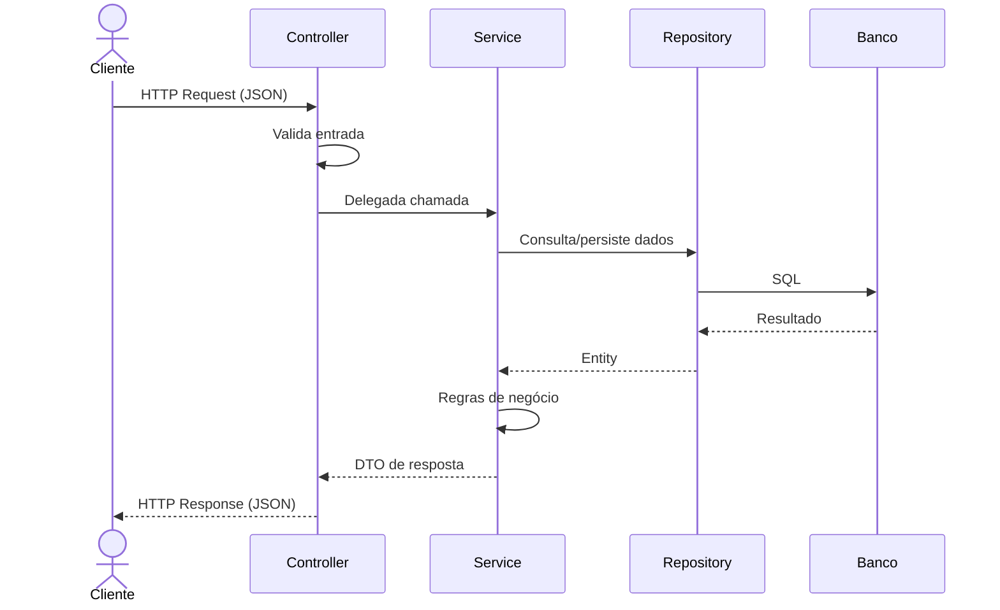
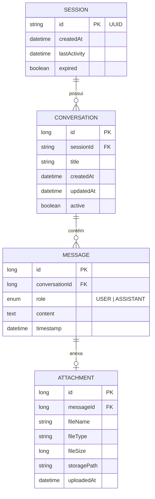

# 🤖 Chat Inteligente — Back-end

<p align="center">
  
  
  
  
  
</p>

<p align="center">
  API REST para chat interativo com suporte a upload de documentos<br>
  🧱 Arquitetura limpa · 🔌 Preparado para IA · 🧪 Testável
</p>

---

## 📋 Sumário

- [Sobre o Projeto](#sobre-o-projeto)
- [Stack Tecnológica](#stack-tecnológica)
- [Arquitetura](#arquitetura)
- [Modelo de Domínio](#modelo-de-domínio)
- [Endpoints da API](#endpoints-da-api)
- [Exemplos de Requisição](#exemplos-de-requisição)
- [Estrutura do Projeto](#estrutura-do-projeto)
- [Como Executar](#como-executar)
- [Validações](#validações)
- [Códigos HTTP](#códigos-http)
- [Preparação para IA](#preparação-para-ia)
- [Licença](#licença)

---

## 📌 Sobre o Projeto

Sistema web de **chat interativo** que permite ao usuário enviar mensagens de texto e fazer upload de documentos (`.txt` e `.pdf`). O back-end gerencia sessões, conversas, mensagens e anexos, retornando respostas **simuladas** — com arquitetura preparada para substituição futura por um motor de **Inteligência Artificial** real.

### Funcionalidades Principais

| Funcionalidade | Descrição |
|----------------|-----------|
| 💬 Envio de mensagens | Envio e resposta simulada com persistência |
| 📄 Upload de documentos | Suporte a `.txt` e `.pdf` (até 10 MB) |
| 🔄 Histórico de conversas | Recuperação por sessão e conversa |
| 🆔 Gerenciamento de sessões | Criação, consulta e expiração automática |
| ❤️ Health check | Monitoramento de saúde da API e banco |

---

## 🛠 Stack Tecnológica

| Camada | Tecnologia | Versão |
|--------|-----------|--------|
| **Linguagem** | Java | 17+ |
| **Framework** | Spring Boot | 3.4.5 |
| **ORM** | Spring Data JPA / Hibernate | 6.x |
| **Validação** | Bean Validation (Jakarta) | — |
| **Banco (dev)** | H2 | 2.x |
| **Banco (prod)** | PostgreSQL | 15+ |
| **Testes** | JUnit 5 + Mockito | — |
| **Build** | Maven | 3.9+ |
| **Monitoramento** | Spring Actuator | — |

---

## 🏗 Arquitetura

### Clean Architecture

O projeto segue os princípios da **Clean Architecture**, organizado em camadas concêntricas onde as dependências apontam para dentro:

```
┌──────────────────────────────────────────────┐
│            Controller Layer                   │
│     (HTTP boundary — entrada/saída)           │
├──────────────────────────────────────────────┤
│              Service Layer                    │
│     (Casos de uso — regras de negócio)        │
├──────────────────────────────────────────────┤
│           Entity / Domain Layer               │
│     (Modelo de domínio + JPA)                 │
├──────────────────────────────────────────────┤
│           Repository Layer                    │
│     (Acesso a dados — persistência)           │
└──────────────────────────────────────────────┘
```

### Regras da Arquitetura

> **📐 Regra 1** — Controllers **nunca** contêm regra de negócio.  
> **📐 Regra 2** — Services **nunca** acessam objetos HTTP diretamente.  
> **📐 Regra 3** — Repositories **nunca** contêm lógica condicional de negócio.  
> **📐 Regra 4** — Entities expõem apenas os setters necessários.  
> **📐 Regra 5** — DTOs são usados **exclusivamente** nas camadas Controller e Service.

### Fluxo de uma Requisição



---

## 📦 Modelo de Domínio



### Entidades

| Entidade | Tabela | Descrição |
|----------|--------|-----------|
| **Session** | `sessions` | Sessão de usuário identificada por UUID |
| **Conversation** | `conversations` | Agrupamento de mensagens em uma sessão |
| **Message** | `messages` | Troca individual (usuário ou assistente) |
| **Attachment** | `attachments` | Metadados do arquivo enviado |

**Políticas de Cascade:**
- `Session → Conversation`: `CASCADE.ALL`
- `Conversation → Message`: `CASCADE.ALL`
- `Message → Attachment`: `CASCADE.ALL`

---

## 🌐 Endpoints da API

### Tabela Resumo

| Método | URL | Descrição | Status |
|--------|-----|-----------|--------|
| `GET` | `/api/health` | Health check da aplicação | 200, 503 |
| `GET` | `/api/session` | Criar/obter nova sessão | 200 |
| `DELETE` | `/api/session/{sessionId}` | Encerrar sessão | 204, 404 |
| `POST` | `/api/chat/message` | Enviar mensagem | 200, 400, 404, 422 |
| `GET` | `/api/chat/history/{sessionId}` | Histórico da sessão | 200, 404 |
| `GET` | `/api/chat/history/{sessionId}/{conversationId}` | Conversa específica | 200, 404 |
| `POST` | `/api/upload` | Upload de arquivo | 200, 400, 413, 415 |

---

## 📥 Exemplos de Requisição

### Enviar Mensagem

```bash
curl -X POST http://localhost:8080/api/chat/message \
  -H "Content-Type: application/json" \
  -d '{
    "sessionId": "uuid-da-sessao",
    "conversationId": null,
    "content": "Olá, qual é a capital do Brasil?"
  }'
```

<details>
<summary><strong>Resposta (200 OK)</strong></summary>

```json
{
  "userMessage": {
    "id": 10,
    "conversationId": 1,
    "role": "USER",
    "content": "Olá, qual é a capital do Brasil?",
    "timestamp": "2026-06-25T14:30:00"
  },
  "assistantMessage": {
    "id": 11,
    "conversationId": 1,
    "role": "ASSISTANT",
    "content": "A capital do Brasil é Brasília.",
    "timestamp": "2026-06-25T14:30:01"
  }
}
```
</details>

### Upload de Arquivo

```bash
curl -X POST http://localhost:8080/api/upload \
  -F "file=@documento.pdf" \
  -F "sessionId=uuid-da-sessao"
```

<details>
<summary><strong>Resposta (200 OK)</strong></summary>

```json
{
  "attachmentId": 5,
  "fileName": "documento.pdf",
  "fileType": "application/pdf",
  "fileSize": 2048000,
  "uploadedAt": "2026-06-25T15:00:00",
  "message": "Arquivo enviado com sucesso."
}
```
</details>

### Health Check

```bash
curl http://localhost:8080/api/health
```

<details>
<summary><strong>Resposta (200 OK)</strong></summary>

```json
{
  "status": "UP",
  "database": "UP",
  "diskSpace": "OK (15.3 GB disponível)",
  "timestamp": "2026-06-25T14:30:00",
  "version": "1.0.0"
}
```
</details>

---

## 📁 Estrutura do Projeto

```
chat-backend/
├── pom.xml
├── README.md
├── src/
│   ├── main/
│   │   ├── java/com/project/chat/
│   │   │   ├── ChatApplication.java
│   │   │   ├── controller/          # Endpoints REST
│   │   │   │   ├── ChatController.java
│   │   │   │   ├── HealthController.java
│   │   │   │   ├── HistoryController.java
│   │   │   │   ├── SessionController.java
│   │   │   │   └── UploadController.java
│   │   │   ├── service/             # Regras de negócio
│   │   │   │   ├── ChatService.java           # Interface
│   │   │   │   ├── SimulatedChatService.java  # Implementação
│   │   │   │   ├── ConversationService.java
│   │   │   │   ├── SessionService.java
│   │   │   │   ├── UploadService.java
│   │   │   │   └── FileStorageService.java
│   │   │   ├── repository/          # Acesso a dados
│   │   │   │   ├── SessionRepository.java
│   │   │   │   ├── ConversationRepository.java
│   │   │   │   ├── MessageRepository.java
│   │   │   │   └── AttachmentRepository.java
│   │   │   ├── entity/              # Modelo JPA
│   │   │   │   ├── Session.java
│   │   │   │   ├── Conversation.java
│   │   │   │   ├── Message.java
│   │   │   │   ├── Attachment.java
│   │   │   │   └── MessageRole.java
│   │   │   ├── dto/                 # Objetos de transferência
│   │   │   │   ├── request/
│   │   │   │   │   ├── ChatRequest.java
│   │   │   │   │   └── UploadRequest.java
│   │   │   │   └── response/
│   │   │   │       ├── ChatResponse.java
│   │   │   │       ├── MessageResponse.java
│   │   │   │       ├── ConversationResponse.java
│   │   │   │       ├── HistoryResponse.java
│   │   │   │       ├── HealthResponse.java
│   │   │   │       ├── SessionResponse.java
│   │   │   │       ├── UploadResponse.java
│   │   │   │       └── ErrorResponse.java
│   │   │   ├── config/              # Configurações Spring
│   │   │   │   ├── CorsConfig.java
│   │   │   │   ├── WebConfig.java
│   │   │   │   └── StorageProperties.java
│   │   │   ├── exception/           # Tratamento de erros
│   │   │   │   ├── GlobalExceptionHandler.java
│   │   │   │   ├── ResourceNotFoundException.java
│   │   │   │   ├── ValidationException.java
│   │   │   │   ├── FileTooLargeException.java
│   │   │   │   └── UnsupportedFileTypeException.java
│   │   │   ├── mapper/              # Conversão Entity → DTO
│   │   │   │   ├── MessageMapper.java
│   │   │   │   ├── ConversationMapper.java
│   │   │   │   └── AttachmentMapper.java
│   │   │   └── util/                # Utilitários
│   │   │       ├── PdfTextExtractor.java
│   │   │       └── FileUtils.java
│   │   └── resources/
│   │       ├── application.yml
│   │       ├── application-dev.yml
│   │       └── application-prod.yml
│   └── test/
│       └── java/com/project/chat/
│           └── ChatApplicationTests.java
```

---

## 🚀 Como Executar

### Pré-requisitos

- Java 17+ ([SDK](https://adoptium.net/))
- Maven 3.9+ ([Download](https://maven.apache.org/download.cgi))
- (Opcional) Docker para PostgreSQL em produção

### Desenvolvimento (H2 — modo memória)

```bash
# Clonar o repositório
git clone <repo-url>
cd chat-backend

# Executar com perfil dev (H2 embarcado)
./mvnw spring-boot:run -Dspring-boot.run.profiles=dev
```

A aplicação iniciará em `http://localhost:8080`.

Console H2 disponível em: `http://localhost:8080/h2-console`  
JDBC URL: `jdbc:h2:mem:chatdb` | User: `sa` | Password: *(vazio)*

### Produção (PostgreSQL)

```bash
# Configurar variáveis de ambiente
export DATABASE_URL=jdbc:postgresql://localhost:5432/chatdb
export DATABASE_USERNAME=postgres
export DATABASE_PASSWORD=postgres

# Build e execução
./mvnw clean package -DskipTests
java -jar target/chat-backend-1.0.0.jar --spring.profiles.active=prod
```

### Testes

```bash
./mvnw test
```

---

## ✅ Validações

| Regra | Código HTTP | Mensagem |
|-------|-------------|----------|
| Mensagem vazia | `422` | O conteúdo da mensagem não pode estar vazio. |
| Mensagem apenas com espaços | `422` | A mensagem não pode conter apenas espaços em branco. |
| Mensagem acima de 5000 caracteres | `422` | A mensagem excede o limite de 5000 caracteres. |
| Arquivo não enviado | `400` | Nenhum arquivo foi enviado. |
| Arquivo > 10 MB | `413` | O arquivo excede o limite máximo de 10 MB. |
| Formato não suportado | `415` | Formato de arquivo não suportado. Utilize .txt ou .pdf. |
| Sessão inválida | `400` | O identificador de sessão fornecido é inválido. |
| Sessão não encontrada | `404` | Sessão não encontrada: {sessionId} |
| Conversa não encontrada | `404` | Conversa não encontrada: {conversationId} |

> **Política:** validações são feitas **no front-end** (para evitar chamadas desnecessárias) e **refeitas no back-end** (por segurança).

---

## 📟 Códigos HTTP

| Código | Descrição | Uso |
|--------|-----------|-----|
| `200 OK` | Sucesso com corpo | Respostas de sucesso |
| `204 No Content` | Sucesso sem corpo | `DELETE /api/session/{id}` |
| `400 Bad Request` | Erro de sintaxe/validação | Parâmetros ausentes, JSON malformado |
| `404 Not Found` | Recurso não encontrado | Sessão, conversa ou anexo inexistente |
| `413 Payload Too Large` | Arquivo excede limite | Upload > 10 MB |
| `415 Unsupported Media Type` | Tipo não suportado | Upload de `.exe`, `.png` |
| `422 Unprocessable Entity` | Validação de negócio | Mensagem vazia |
| `500 Internal Server Error` | Erro inesperado | Falha interna não tratada |

---

## 🤖 Preparação para IA

A camada de **Service** foi projetada com uma interface que permite a substituição do atual simulador por um motor real de IA sem impactar o resto do sistema:

```java
// Interface atual — usada pelos Controllers
public interface ChatService {
    ChatResponse sendMessage(ChatRequest request);
}

// Implementação atual — retorna respostas mockadas
@Service
public class SimulatedChatService implements ChatService { ... }

// Futura implementação — integrará com LLM
// @Service
// public class AIChatService implements ChatService { ... }
```

**Benefícios desta abordagem:**
- ✅ Troca transparente — Controllers não precisam ser alterados
- ✅ Baixo acoplamento — Front-end desconhece a implementação
- ✅ Testabilidade — Mock fácil da interface nos testes

---

## 📄 Licença

Este projeto está sob a licença MIT. Veja o arquivo [LICENSE](LICENSE) para mais detalhes.

---

<p align="center">
  Feito com ☕ e Spring Boot
</p>
