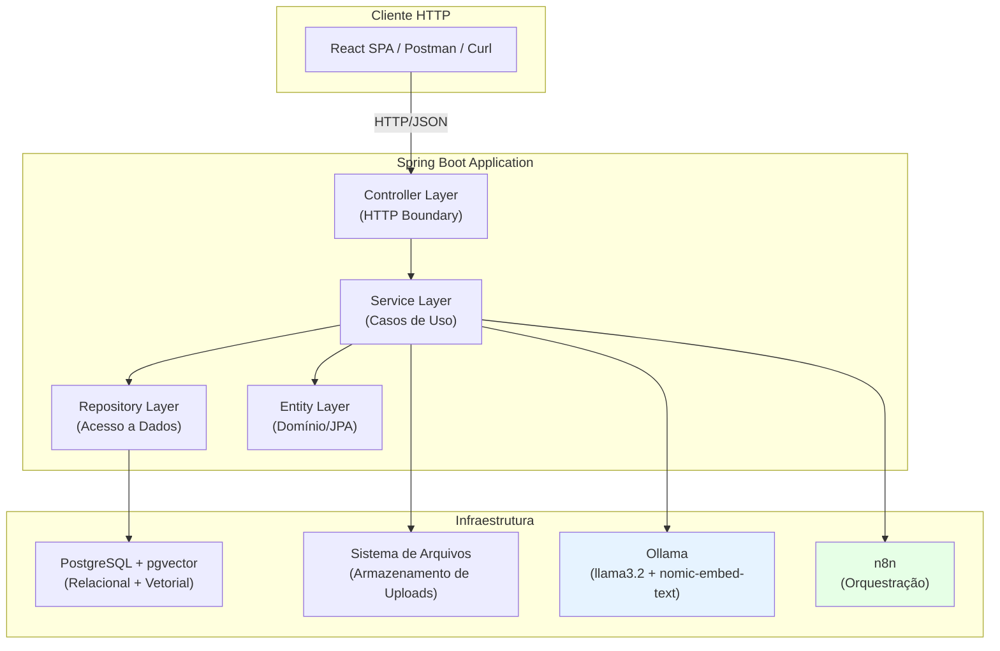
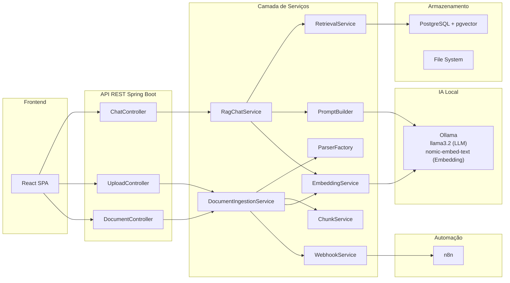
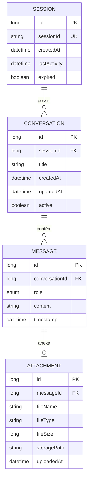
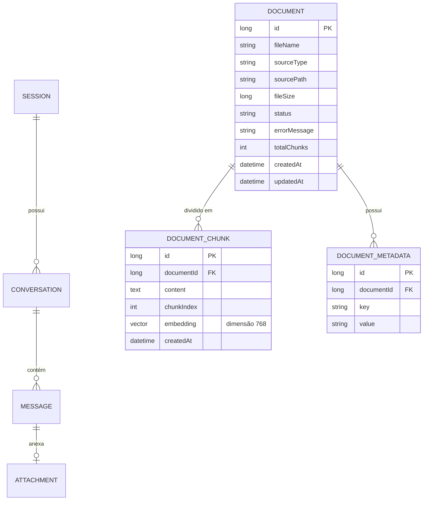
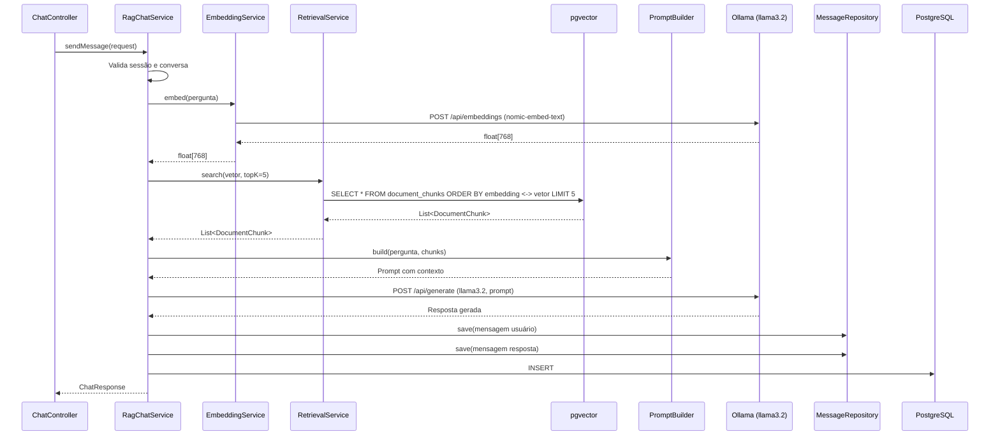
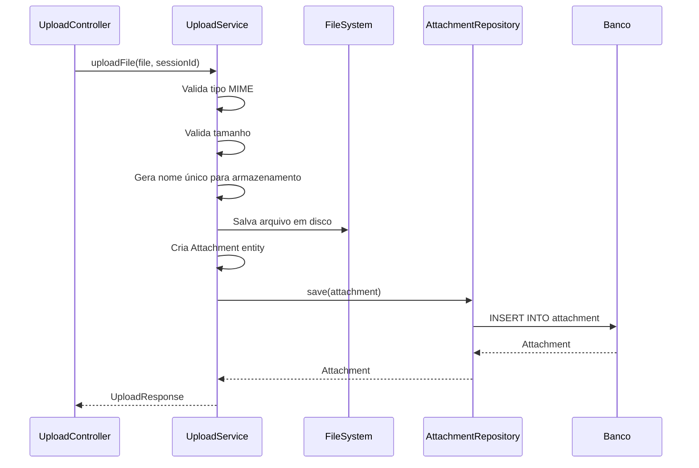
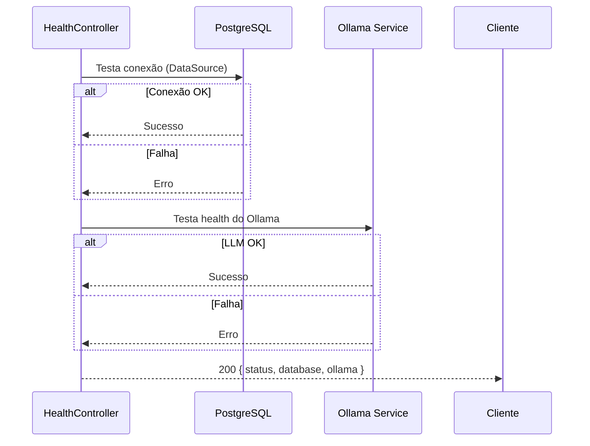
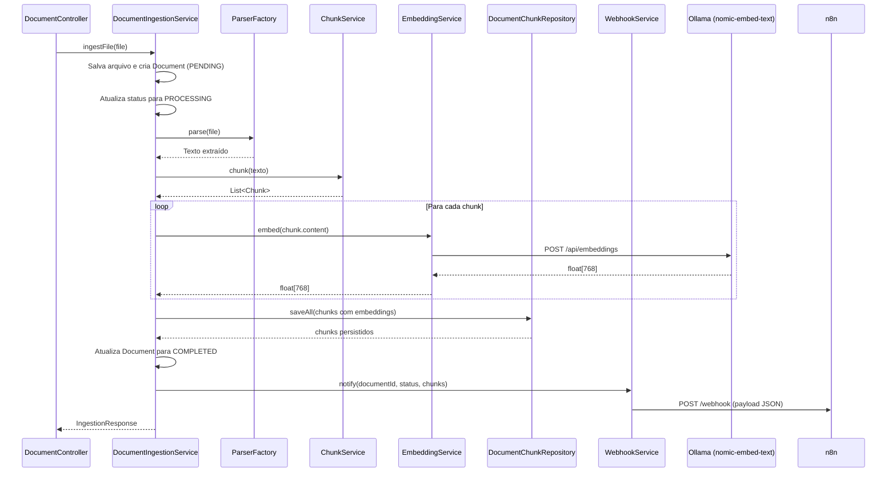
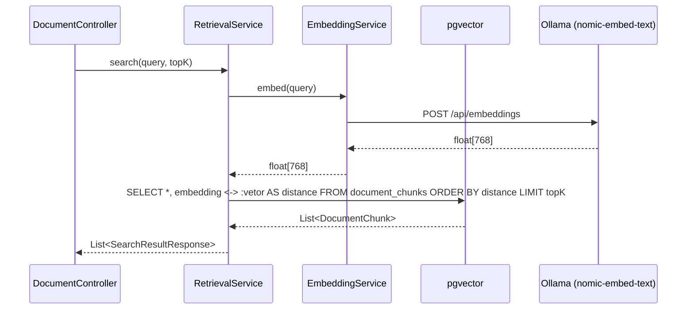

# System Docs — Back-end

> **Contrato oficial — Camada Back-end do Assistente MCU RAG**  
> Versão: 2.0.0  
> Stack: Java 17+, Spring Boot 3.x, JPA/Hibernate, PostgreSQL + pgvector, Ollama, n8n  
> Propósito: Documentação arquitetural do back-end para equipe de desenvolvimento e geração automática de código por IA.

---

## Sumário

1. [Visão Geral do Back-end](#1-visão-geral-do-back-end)
2. [Arquitetura Back-end](#2-arquitetura-back-end)
3. [Domínio da Aplicação](#3-domínio-da-aplicação)
4. [API REST](#4-api-rest)
5. [Contratos JSON](#5-contratos-json)
6. [Fluxos do Back-end](#6-fluxos-do-back-end)
7. [Persistência](#7-persistência)
8. [Validações](#8-validações)
9. [Códigos HTTP](#9-códigos-http)
10. [Tratamento de Exceções](#10-tratamento-de-exceções)
11. [Requisitos Não Funcionais](#11-requisitos-não-funcionais)
12. [Estrutura de Diretórios](#12-estrutura-de-diretórios)
13. [README](#13-readme)
14. [AGENTS.md](#14-agentsmd)
15. [Considerações Arquiteturais](#15-considerações-arquiteturais)
16. [Pipeline de Ingestão](#16-pipeline-de-ingestão)
17. [Fluxo RAG (Retrieval-Augmented Generation)](#17-fluxo-rag-retrieval-augmented-generation)
18. [Parser Strategy Pattern](#18-parser-strategy-pattern)
19. [Embedding Service](#19-embedding-service)
20. [Chunking Service](#20-chunking-service)
21. [Integração com Ollama](#21-integração-com-ollama)
22. [Webhook n8n](#22-webhook-n8n)
23. [Docker e Docker Compose](#23-docker-e-docker-compose)

---

# 1. Visão Geral do Back-end

## 1.1 Objetivo

API REST do **Assistente Inteligente especializado no Universo Cinematográfico Marvel (MCU)**. O sistema gerencia sessões, conversas, mensagens, upload de documentos e utiliza um pipeline RAG (Retrieval-Augmented Generation) para responder perguntas baseando-se exclusivamente em conhecimento previamente indexado em banco vetorial.

O conhecimento NÃO é obtido diretamente da internet — todo o conteúdo é ingerido via pipeline próprio (PDF, TXT, Markdown, HTML, URLs da Wikipedia).

## 1.2 Tecnologias

| Componente | Tecnologia |
|------------|-----------|
| Linguagem | Java 17+ |
| Framework | Spring Boot 3.x |
| ORM | Spring Data JPA / Hibernate 6 |
| Banco relacional | PostgreSQL 15+ |
| Banco vetorial | pgvector (extensão PostgreSQL) |
| Modelo LLM local | Ollama — `llama3.2` |
| Modelo de embedding | Ollama — `nomic-embed-text` ou `mxbai-embed-large` |
| Orquestração | n8n |
| Parsing de PDF | Apache PDFBox |
| Testes | JUnit 5 + Mockito |
| Build | Maven 3.9+ |
| Containerização | Docker + Docker Compose |
| Documentação | Markdown + Mermaid |

## 1.3 Escopo

| Inclui | Não inclui |
|--------|-----------|
| CRUD de mensagens, conversas e sessões | Autenticação/autorização |
| Upload de `.txt`, `.pdf`, `.md` e `.html` | WebSocket / streaming |
| Parsing de documentos via Strategy Pattern | Fila de processamento assíncrono |
| Chunking de texto (800 chars, overlap 120) | Cache distribuído |
| Embedding via Ollama (modelo local) | Versionamento de anexos |
| Indexação vetorial via pgvector | Integração com LLMs pagos (OpenAI, Claude) |
| Busca por similaridade semântica (cosseno) | APIs pagas de qualquer tipo |
| Geração de resposta via RAG com `llama3.2` | |
| Webhook para n8n após ingestão | |
| Ingestão de URLs (Wikipedia) | |
| Docker Compose para ambiente completo | |

## 1.4 Arquitetura Geral do Back-end



### Arquitetura Detalhada do RAG



---

# 2. Arquitetura Back-end

## 2.1 Clean Architecture

O back-end segue os princípios da **Clean Architecture** (Robert C. Martin), organizada em camadas concêntricas onde dependências apontam para dentro.

```
┌──────────────────────────────────────────────────┐
│                   Controllers                      │
│         (HTTP boundary — orquestração)             │
├──────────────────────────────────────────────────┤
│                    Services                         │
│         (Casos de uso — regras de negócio)          │
├──────────────────────────────────────────────────┤
│                   Repositories                      │
│            (Acesso a dados — persistência)          │
├──────────────────────────────────────────────────┤
│                    Entities                         │
│            (Modelo de domínio anêmico)              │
├──────────────────────────────────────────────────┤
│   DTOs  │  Config  │  Exception  │  Mapper  │ Util │
├──────────────────────────────────────────────────┤
│        parser / chunking / embedding / rag         │
│        (Subpacotes especializados)                 │
└──────────────────────────────────────────────────┘
```

## 2.2 Responsabilidade de Cada Camada

### Controller
- Receber requisições HTTP.
- Validar entrada (formato, presença de parâmetros) via `@Valid`.
- Invocar o Service apropriado.
- Retornar resposta HTTP com DTO e status code.
- **Não contém regra de negócio.**

```java
@RestController
@RequestMapping("/api/chat")
public class ChatController {
    private final ChatService chatService;

    @PostMapping("/message")
    public ResponseEntity<ChatResponse> sendMessage(@RequestBody @Valid ChatRequest request) {
        ChatResponse response = chatService.sendMessage(request);
        return ResponseEntity.ok(response);
    }
}
```

### Service
- Implementar todos os casos de uso.
- Orquestrar entidades e repositórios.
- Aplicar regras de validação de negócio.
- Transformar entidades em DTOs (via Mapper).
- **Independente de HTTP** — sem referência a objetos de servlet.

```java
@Service
public class RagChatService implements ChatService {
    private final EmbeddingService embeddingService;
    private final RetrievalService retrievalService;
    private final PromptBuilder promptBuilder;
    private final OllamaChatService ollamaChatService;

    @Override
    public ChatResponse sendMessage(ChatRequest request) {
        // 1. Embedding da pergunta
        float[] questionVector = embeddingService.embed(request.getContent());
        // 2. Busca vetorial por chunks similares
        List<DocumentChunk> relevantChunks = retrievalService.search(questionVector, 5);
        // 3. Construção do prompt com contexto
        String prompt = promptBuilder.build(request.getContent(), relevantChunks);
        // 4. Geração da resposta via LLM local
        String answer = ollamaChatService.generate(prompt);
        // 5. Persistência e retorno
        return buildChatResponse(request, answer);
    }
}
```

### Repository
- Interface com o banco via Spring Data JPA.
- Métodos de CRUD e consultas customizadas com `@Query`.
- Queries nativas para similaridade vetorial (`<->` operator).
- **Não contém regra de negócio.**

```java
public interface DocumentChunkRepository extends JpaRepository<DocumentChunk, Long> {
    @Query(value = "SELECT * FROM document_chunks ORDER BY embedding <-> :embedding::vector LIMIT :topK", nativeQuery = true)
    List<DocumentChunk> findSimilarChunks(@Param("embedding") String embedding, @Param("topK") int topK);

    List<DocumentChunk> findByDocumentIdOrderByChunkIndex(Long documentId);
}
```

### Entity
- Modelo de domínio com anotações JPA.
- Relacionamentos, constraints e cascade.
- Estado puro — sem lógica de negócio complexa.

### DTO
- `request/`: dados recebidos na API.
- `response/`: dados devolvidos na API.
- Isolam a representação externa do modelo interno.

| DTO | Tipo | Finalidade |
|-----|------|------------|
| `ChatRequest` | Request | sessionId, conversationId, content, attachmentId |
| `ChatResponse` | Response | userMessage, assistantMessage |
| `HistoryResponse` | Response | sessionId, lista de conversas |
| `HealthResponse` | Response | status, database, diskSpace, timestamp, version |
| `SessionResponse` | Response | sessionId, createdAt, lastActivity, expired |
| `UploadResponse` | Response | attachmentId, fileName, fileType, fileSize, uploadedAt |
| `ErrorResponse` | Response | status, error, message, timestamp, path |
| `DocumentResponse` | Response | documentId, fileName, sourceType, status, createdAt |
| `DocumentsListResponse` | Response | lista de documentos (`{ documents: [DocumentResponse] }`) |
| `IngestionResponse` | Response | documentId, fileName, status, chunks, processingTime |
| `SearchResultResponse` | Response | chunks encontrados com score de similaridade |

### Exception
- Hierarquia de exceções de negócio.
- `GlobalExceptionHandler` com `@RestControllerAdvice` mapeia para HTTP.

### Configuration
- Beans do Spring: CORS, ObjectMapper, propriedades de upload, Ollama client, chunking.

### Mapper
- Converte Entity ↔ DTO.
- Utiliza padrão Builder ou MapStruct.

### Util
- Funções auxiliares: extração de texto de PDF, formatação, validação de tipos.

### Pacotes Especializados (Novos)
- `parser/` — Strategy Pattern para parsing de documentos (PdfParser, TxtParser, MarkdownParser, ParserFactory)
- `chunking/` — Serviço de divisão de texto em chunks com tamanho e overlap configuráveis
- `embedding/` — Serviço agnóstico de embedding (recebe texto, devolve vetor)
- `rag/` — PromptBuilder e lógica de aumento de contexto para o LLM
- `retrieval/` — Busca vetorial via pgvector

## 2.3 Regras Fundamentais

> **Regra 1:** Controller **nunca** contém regra de negócio.  
> **Regra 2:** Service **nunca** acessa objetos HTTP.  
> **Regra 3:** Repository **nunca** contém lógica condicional de negócio.  
> **Regra 4:** DTO **nunca** é usado fora das camadas Controller e Service.  
> **Regra 5:** Entity **nunca** expõe setters públicos para campos sensíveis.  
> **Regra 6:** Parser **nunca** é chamado dentro de Controller ou EmbeddingService — sempre via ParserFactory.  
> **Regra 7:** EmbeddingService é **agnóstico** — não conhece domínio, banco, documentos ou controllers.

---

# 3. Domínio da Aplicação

## 3.1 Entidades Legadas

### Session

| Atributo | Tipo | Descrição |
|----------|------|-----------|
| `id` | `Long` | Identificador único |
| `sessionId` | `String` | UUID público da sessão |
| `createdAt` | `LocalDateTime` | Data de criação |
| `lastActivity` | `LocalDateTime` | Última interação |
| `expired` | `boolean` | Se a sessão expirou |

**Relacionamentos:** `1:N` com `Conversation`

---

### Conversation

| Atributo | Tipo | Descrição |
|----------|------|-----------|
| `id` | `Long` | Identificador único |
| `session` | `Session` | Sessão pai |
| `title` | `String` | Título gerado automaticamente |
| `createdAt` | `LocalDateTime` | Data de criação |
| `updatedAt` | `LocalDateTime` | Última atividade |
| `active` | `boolean` | Se está ativa |

**Relacionamentos:** `N:1` com `Session`, `1:N` com `Message`

---

### Message

| Atributo | Tipo | Descrição |
|----------|------|-----------|
| `id` | `Long` | Identificador único |
| `conversation` | `Conversation` | Conversa pai |
| `role` | `enum (USER, ASSISTANT)` | Remetente |
| `content` | `String (TEXT)` | Conteúdo |
| `timestamp` | `LocalDateTime` | Momento do envio |
| `attachment` | `Attachment` | Anexo opcional |

**Relacionamentos:** `N:1` com `Conversation`, `1:1` opcional com `Attachment`

---

### Attachment

| Atributo | Tipo | Descrição |
|----------|------|-----------|
| `id` | `Long` | Identificador único |
| `message` | `Message` | Mensagem associada |
| `fileName` | `String` | Nome original |
| `fileType` | `String` | Tipo MIME |
| `fileSize` | `Long` | Tamanho em bytes |
| `storagePath` | `String` | Caminho físico |
| `uploadedAt` | `LocalDateTime` | Data do upload |

**Relacionamentos:** `1:1` com `Message`

---

### HealthStatus (Value Object)

| Atributo | Tipo | Descrição |
|----------|------|-----------|
| `status` | `String` | `UP` ou `DOWN` |
| `database` | `String` | Status do banco |
| `diskSpace` | `String` | Espaço disponível |
| `timestamp` | `LocalDateTime` | Momento da verificação |
| `version` | `String` | Versão da aplicação |

> **Nota:** `HealthStatus` não é entidade persistida — é Value Object/DTO retornado pelo health check.

## 3.2 Modelo Conceitual (ER) — Legado



## 3.3 Novas Entidades do RAG

### Document

| Atributo | Tipo | Descrição |
|----------|------|-----------|
| `id` | `Long` | Identificador único |
| `fileName` | `String` | Nome original do arquivo |
| `sourceType` | `String` | Tipo de fonte: PDF, TXT, MARKDOWN, HTML, URL |
| `sourcePath` | `String` | Caminho do arquivo ou URL |
| `fileSize` | `Long` | Tamanho em bytes |
| `status` | `String` | Status da indexação: PENDING, PROCESSING, COMPLETED, FAILED |
| `errorMessage` | `String` | Mensagem de erro se falhou |
| `totalChunks` | `Integer` | Total de chunks gerados |
| `createdAt` | `LocalDateTime` | Data de criação |
| `updatedAt` | `LocalDateTime` | Última atualização |

**Relacionamentos:** `1:N` com `DocumentChunk`, `1:N` com `DocumentMetadata`

---

### DocumentChunk

| Atributo | Tipo | Descrição |
|----------|------|-----------|
| `id` | `Long` | Identificador único |
| `document` | `Document` | Documento pai |
| `content` | `String (TEXT)` | Conteúdo textual do chunk |
| `chunkIndex` | `Integer` | Ordem do chunk no documento |
| `embedding` | `float[]` (VECTOR) | Vetor de embedding (pgvector) |
| `createdAt` | `LocalDateTime` | Data de criação |

**Relacionamentos:** `N:1` com `Document`

> **Nota:** A coluna `embedding` é mapeada como `VECTOR(768)` no PostgreSQL via pgvector. Não utilizar JSON para armazenamento de vetores.

---

### DocumentMetadata (Opcional)

| Atributo | Tipo | Descrição |
|----------|------|-----------|
| `id` | `Long` | Identificador único |
| `document` | `Document` | Documento pai |
| `key` | `String` | Chave do metadado |
| `value` | `String` | Valor do metadado |

**Relacionamentos:** `N:1` com `Document`

## 3.4 Modelo Conceitual (ER) — Completo



---

# 4. API REST

## 4.1 Endpoints Legados

### `GET /api/health`

| Campo | Valor |
|-------|-------|
| Método | `GET` |
| URL | `/api/health` |
| Descrição | Verifica saúde da aplicação e conexões |
| Payload Entrada | — |
| Payload Saída | `HealthResponse` |
| Status Sucesso | `200 OK` |
| Erros | `500` (banco inacessível retorna `status: "DOWN"`) |

---

### `GET /api/session`

| Campo | Valor |
|-------|-------|
| Método | `GET` |
| URL | `/api/session` |
| Descrição | Cria nova sessão |
| Payload Entrada | — |
| Payload Saída | `SessionResponse` |
| Status Sucesso | `200 OK` |
| Erros | — |

---

### `DELETE /api/session/{sessionId}`

| Campo | Valor |
|-------|-------|
| Método | `DELETE` |
| URL | `/api/session/{sessionId}` |
| Descrição | Encerra uma sessão |
| Payload Entrada | — |
| Payload Saída | — |
| Status Sucesso | `204 No Content` |
| Erros | `404` (sessão não encontrada) |

---

### `POST /api/chat/message`

| Campo | Valor |
|-------|-------|
| Método | `POST` |
| URL | `/api/chat/message` |
| Descrição | Envia mensagem e recebe resposta via RAG (ou simulada, conforme perfil) |
| Payload Entrada | `ChatRequest` |
| Payload Saída | `ChatResponse` |
| Status Sucesso | `200 OK` |
| Erros | `400`, `404`, `422`, `502` (LLM indisponível) |

---

### `GET /api/chat/history/{sessionId}`

| Campo | Valor |
|-------|-------|
| Método | `GET` |
| URL | `/api/chat/history/{sessionId}` |
| Descrição | Recupera lista de conversas da sessão |
| Payload Entrada | — |
| Payload Saída | `HistoryResponse` |
| Status Sucesso | `200 OK` |
| Erros | `404` |

---

### `GET /api/chat/history/{sessionId}/{conversationId}`

| Campo | Valor |
|-------|-------|
| Método | `GET` |
| URL | `/api/chat/history/{sessionId}/{conversationId}` |
| Descrição | Recupera mensagens de uma conversa |
| Payload Entrada | — |
| Payload Saída | `ConversationResponse` |
| Status Sucesso | `200 OK` |
| Erros | `404` |

---

### `POST /api/upload`

| Campo | Valor |
|-------|-------|
| Método | `POST` |
| URL | `/api/upload` |
| Descrição | Upload de arquivo `.txt` ou `.pdf` (vinculado a uma mensagem) |
| Payload Entrada | `multipart/form-data` (`file` + `sessionId`) |
| Payload Saída | `UploadResponse` |
| Status Sucesso | `200 OK` |
| Erros | `400`, `413`, `415` |

## 4.2 Novos Endpoints de Ingestão

### `POST /api/documents/ingest`

| Campo | Valor |
|-------|-------|
| Método | `POST` |
| URL | `/api/documents/ingest` |
| Descrição | Inicia o pipeline de ingestão de um documento |
| Payload Entrada | `multipart/form-data` (`file` + opcional `sourceType`) |
| Payload Saída | `IngestionResponse` |
| Status Sucesso | `202 Accepted` (processamento iniciado) |
| Erros | `400`, `413`, `415`, `422` |

---

### `POST /api/documents/ingest/url`

| Campo | Valor |
|-------|-------|
| Método | `POST` |
| URL | `/api/documents/ingest/url` |
| Descrição | Inicia ingestão a partir de uma URL |
| Payload Entrada | JSON (`url`, `sourceType`) |
| Payload Saída | `IngestionResponse` |
| Status Sucesso | `202 Accepted` |
| Erros | `400`, `422` |

---

### `GET /api/documents`

| Campo | Valor |
|-------|-------|
| Método | `GET` |
| URL | `/api/documents` |
| Descrição | Lista todos os documentos indexados |
| Payload Entrada | — |
| Payload Saída | `DocumentsListResponse` (`{ documents: [DocumentResponse] }`) |
| Status Sucesso | `200 OK` |
| Erros | — |

---

### `GET /api/documents/{documentId}`

| Campo | Valor |
|-------|-------|
| Método | `GET` |
| URL | `/api/documents/{documentId}` |
| Descrição | Detalhes de um documento específico |
| Payload Entrada | — |
| Payload Saída | `DocumentResponse` |
| Status Sucesso | `200 OK` |
| Erros | `404` |

---

### `DELETE /api/documents/{documentId}`

| Campo | Valor |
|-------|-------|
| Método | `DELETE` |
| URL | `/api/documents/{documentId}` |
| Descrição | Remove um documento e seus chunks |
| Payload Entrada | — |
| Payload Saída | — |
| Status Sucesso | `204 No Content` |
| Erros | `404` |

---

### `GET /api/documents/{documentId}/chunks`

| Campo | Valor |
|-------|-------|
| Método | `GET` |
| URL | `/api/documents/{documentId}/chunks` |
| Descrição | Lista os chunks de um documento |
| Payload Entrada | — |
| Payload Saída | `List<DocumentChunkResponse>` |
| Status Sucesso | `200 OK` |
| Erros | `404` |

---

### `POST /api/documents/search`

| Campo | Valor |
|-------|-------|
| Método | `POST` |
| URL | `/api/documents/search` |
| Descrição | Busca semântica por chunks similares |
| Payload Entrada | JSON (`query`, `topK`) |
| Payload Saída | `List<SearchResultResponse>` |
| Status Sucesso | `200 OK` |
| Erros | `400`, `502` |

## 4.3 Tabela Resumo Completa

| Método | URL | Controller | Service |
|--------|-----|------------|---------|
| `GET` | `/api/health` | `HealthController` | — (Spring Actuator) |
| `GET` | `/api/session` | `SessionController` | `SessionService` |
| `DELETE` | `/api/session/{sessionId}` | `SessionController` | `SessionService` |
| `POST` | `/api/chat/message` | `ChatController` | `ChatService` (RagChatService) |
| `GET` | `/api/chat/history/{sessionId}` | `ChatController` | `ChatService` |
| `GET` | `/api/chat/history/{sessionId}/{conversationId}` | `ChatController` | `ChatService` |
| `POST` | `/api/upload` | `UploadController` | `UploadService` |
| `POST` | `/api/documents/ingest` | `DocumentController` | `DocumentIngestionService` |
| `POST` | `/api/documents/ingest/url` | `DocumentController` | `DocumentIngestionService` |
| `GET` | `/api/documents` | `DocumentController` | `DocumentIngestionService` |
| `GET` | `/api/documents/{documentId}` | `DocumentController` | `DocumentIngestionService` |
| `DELETE` | `/api/documents/{documentId}` | `DocumentController` | `DocumentIngestionService` |
| `GET` | `/api/documents/{documentId}/chunks` | `DocumentController` | `DocumentIngestionService` |
| `POST` | `/api/documents/search` | `DocumentController` | `RetrievalService` |

---

# 5. Contratos JSON

## 5.1 `POST /api/chat/message`

### Request
```json
{
  "sessionId": "a1b2c3d4-e5f6-7890-abcd-ef1234567890",
  "conversationId": null,
  "content": "Quem é o Homem de Ferro?",
  "attachmentId": null
}
```

### Response (200)
```json
{
  "userMessage": {
    "id": 10,
    "conversationId": 1,
    "role": "USER",
    "content": "Quem é o Homem de Ferro?",
    "timestamp": "2026-06-25T14:30:00Z",
    "attachment": null
  },
  "assistantMessage": {
    "id": 11,
    "conversationId": 1,
    "role": "ASSISTANT",
    "content": "O Homem de Ferro é Tony Stark, um bilionário, gênio inventor e playboy que criou uma armadura tecnológica para salvar sua vida e combater ameaças. Ele é um dos membros fundadores dos Vingadores no Universo Cinematográfico Marvel, interpretado por Robert Downey Jr.",
    "timestamp": "2026-06-25T14:30:01Z"
  },
  "conversationId": 1
}
```

### Erro (400 — validação)
```json
{
  "status": 400,
  "error": "Bad Request",
  "message": "O conteúdo da mensagem não pode estar vazio.",
  "timestamp": "2026-06-25T14:30:00Z",
  "path": "/api/chat/message"
}
```

### Erro (404 — sessão não encontrada)
```json
{
  "status": 404,
  "error": "Not Found",
  "message": "Sessão não encontrada: a1b2c3d4-e5f6-7890-abcd-ef1234567890",
  "timestamp": "2026-06-25T14:30:00Z",
  "path": "/api/chat/message"
}
```

### Erro (422 — mensagem inválida)
```json
{
  "status": 422,
  "error": "Unprocessable Entity",
  "message": "A mensagem excede o limite de 5000 caracteres.",
  "timestamp": "2026-06-25T14:30:00Z",
  "path": "/api/chat/message"
}
```

### Erro (502 — LLM indisponível)
```json
{
  "status": 502,
  "error": "Bad Gateway",
  "message": "O serviço de inteligência artificial está temporariamente indisponível. Tente novamente mais tarde.",
  "timestamp": "2026-06-25T14:30:00Z",
  "path": "/api/chat/message"
}
```

---

## 5.2 `GET /api/chat/history/{sessionId}`

### Response (200)
```json
{
  "sessionId": "a1b2c3d4-e5f6-7890-abcd-ef1234567890",
  "conversations": [
    {
      "id": 1,
      "title": "Heróis do MCU",
      "messageCount": 4,
      "lastMessage": "O Homem de Ferro é Tony Stark...",
      "lastActivity": "2026-06-25T14:30:01Z"
    }
  ]
}
```

### Erro (404)
```json
{
  "status": 404,
  "error": "Not Found",
  "message": "Nenhuma conversa encontrada para a sessão: uuid-invalido",
  "timestamp": "2026-06-25T14:30:00Z",
  "path": "/api/chat/history/uuid-invalido"
}
```

---

## 5.3 `POST /api/upload`

### Request (multipart/form-data)

| Campo | Tipo | Obrigatório | Descrição |
|-------|------|-------------|-----------|
| `file` | `File` | Sim | Arquivo `.txt` ou `.pdf` (máx. 10 MB) |
| `sessionId` | `String` | Sim | UUID da sessão |

### Response (200)
```json
{
  "attachmentId": 5,
  "fileName": "relatorio.pdf",
  "fileType": "application/pdf",
  "fileSize": 2048000,
  "uploadedAt": "2026-06-25T15:00:00Z",
  "message": "Arquivo enviado com sucesso."
}
```

### Erro (400 — arquivo não enviado)
```json
{
  "status": 400,
  "error": "Bad Request",
  "message": "Nenhum arquivo foi enviado.",
  "timestamp": "2026-06-25T15:00:00Z",
  "path": "/api/upload"
}
```

### Erro (413 — arquivo excede limite)
```json
{
  "status": 413,
  "error": "Payload Too Large",
  "message": "O arquivo excede o limite máximo de 10 MB.",
  "timestamp": "2026-06-25T15:00:00Z",
  "path": "/api/upload"
}
```

### Erro (415 — formato não suportado)
```json
{
  "status": 415,
  "error": "Unsupported Media Type",
  "message": "Formato de arquivo não suportado. Utilize .txt ou .pdf.",
  "timestamp": "2026-06-25T15:00:00Z",
  "path": "/api/upload"
}
```

---

## 5.4 `GET /api/health`

### Response (200 — UP)
```json
{
  "status": "UP",
  "database": "UP",
  "ollama": "UP",
  "diskSpace": "OK (15.3 GB disponível)",
  "timestamp": "2026-06-25T14:30:00Z",
  "version": "2.0.0"
}
```

### Response (200 — DOWN)
```json
{
  "status": "DEGRADED",
  "database": "UP",
  "ollama": "DOWN",
  "diskSpace": "OK (15.3 GB disponível)",
  "timestamp": "2026-06-25T14:30:00Z",
  "version": "2.0.0"
}
```

---

## 5.5 `GET /api/session`

### Response (200)
```json
{
  "sessionId": "a1b2c3d4-e5f6-7890-abcd-ef1234567890",
  "createdAt": "2026-06-25T14:30:00Z",
  "lastActivity": "2026-06-25T14:30:00Z",
  "expired": false
}
```

---

## 5.6 Erro Genérico (500)
```json
{
  "status": 500,
  "error": "Internal Server Error",
  "message": "Ocorreu um erro inesperado. Tente novamente mais tarde.",
  "timestamp": "2026-06-25T14:30:00Z",
  "path": "/api/chat/message"
}
```

---

## 5.7 `POST /api/documents/ingest`

### Request (multipart/form-data)

| Campo | Tipo | Obrigatório | Descrição |
|-------|------|-------------|-----------|
| `file` | `File` | Sim | Arquivo `.txt`, `.pdf`, `.md` ou `.html` |
| `sourceType` | `String` | Não | `PDF`, `TXT`, `MARKDOWN`, `HTML` (detectado automaticamente se omitido) |

### Response (202 — Aceito)
```json
{
  "documentId": 1,
  "fileName": "mcu_wikipedia.pdf",
  "status": "PROCESSING",
  "chunks": 0,
  "processingTime": 0,
  "message": "Documento enviado para processamento."
}
```

---

## 5.8 `POST /api/documents/ingest/url`

### Request
```json
{
  "url": "https://pt.wikipedia.org/wiki/Universo_Cinematogr%C3%A1fico_Marvel",
  "sourceType": "URL"
}
```

### Response (202)
```json
{
  "documentId": 2,
  "fileName": "Universo_Cinematográfico_Marvel",
  "status": "PROCESSING",
  "chunks": 0,
  "processingTime": 0,
  "message": "URL enviada para processamento."
}
```

---

## 5.9 `GET /api/documents`

### Response (200)
```json
{
  "documents": [
    {
      "id": 1,
      "fileName": "mcu_wikipedia.pdf",
      "sourceType": "PDF",
      "fileSize": 2048000,
      "status": "COMPLETED",
      "totalChunks": 45,
      "createdAt": "2026-06-25T15:00:00Z"
    }
  ]
}
```

---

## 5.10 `POST /api/documents/search`

### Request
```json
{
  "query": "Qual a origem do Thanos?",
  "topK": 5
}
```

### Response (200)
```json
{
  "results": [
    {
      "chunkId": 120,
      "documentId": 1,
      "fileName": "mcu_wikipedia.pdf",
      "content": "Thanos é um titã nascido em Titã...",
      "similarityScore": 0.92,
      "chunkIndex": 12
    }
  ]
}
```

---

## 5.11 Webhook n8n Payload

### POST (para URL configurável)
```json
{
  "documentId": 1,
  "fileName": "mcu_wikipedia.pdf",
  "status": "COMPLETED",
  "chunks": 45,
  "embeddingModel": "nomic-embed-text",
  "processingTime": 1234,
  "timestamp": "2026-06-25T15:05:00Z"
}
```

---

# 6. Fluxos do Back-end

## 6.1 Fluxo de Envio de Mensagem (RAG)



## 6.2 Fluxo de Upload (Legado)



## 6.3 Fluxo de Health Check



## 6.4 Fluxo de Ingestão de Documento



## 6.5 Fluxo de Busca Semântica



---

# 7. Persistência

## 7.1 Políticas — Entidades Legadas

| Relacionamento | Cascade | Fetch |
|----------------|---------|-------|
| `Session → Conversation` | `ALL` | `LAZY` |
| `Conversation → Message` | `ALL` | `LAZY` |
| `Message → Attachment` | `ALL` | `LAZY` |

## 7.2 Políticas — Novas Entidades RAG

| Relacionamento | Cascade | Fetch |
|----------------|---------|-------|
| `Document → DocumentChunk` | `ALL` | `LAZY` |
| `Document → DocumentMetadata` | `ALL` | `LAZY` |

## 7.3 Regras de Remoção

- Remover uma `Session` remove todas as suas `Conversation`, `Message` e `Attachment` em cascata.
- Remover uma `Conversation` remove todas as suas `Message` e `Attachment` em cascata.
- Remover uma `Message` remove seu `Attachment` em cascata (e o arquivo físico deve ser excluído pelo service).
- Remover um `Document` remove todos os seus `DocumentChunk` e `DocumentMetadata` em cascata.

## 7.4 pgvector

### Instalação

A extensão pgvector deve estar instalada no PostgreSQL. No Docker Compose, utilizar a imagem `pgvector/pgvector:pg16`.

### Configuração JPA

A coluna `embedding` é mapeada como `VECTOR(768)` no banco. Utilizar a anotação `@Column(columnDefinition = "VECTOR(768)")`.

> **Nota:** Hibernate não possui mapeamento nativo para o tipo VECTOR. Utilizar consultas nativas (`@Query` com `nativeQuery = true`) para operações de similaridade.

### Exemplo de Query de Similaridade

```java
@Query(value = "SELECT * FROM document_chunks ORDER BY embedding <-> CAST(:embedding AS vector) LIMIT :topK", nativeQuery = true)
List<DocumentChunk> findSimilarChunks(@Param("embedding") String embedding, @Param("topK") int topK);
```

### Índice para Busca Vetorial

```sql
CREATE INDEX ON document_chunks USING ivfflat (embedding vector_cosine_ops) WITH (lists = 100);
```

## 7.5 Índices Sugeridos

| Tabela | Coluna(s) | Tipo |
|--------|-----------|------|
| `session` | `session_id` | Único |
| `conversation` | `session_id` | Simples |
| `message` | `conversation_id` | Simples |
| `message` | `timestamp` | Simples |
| `document` | `status` | Simples |
| `document_chunk` | `document_id` | Simples |
| `document_chunk` | `embedding` | IVFFlat (pgvector) |

## 7.6 Configuração de Pool

```yaml
spring.datasource.hikari.maximum-pool-size=10
spring.datasource.hikari.minimum-idle=2
spring.datasource.hikari.connection-timeout=30000
```

---

# 8. Validações

## 8.1 Tabela de Validações — Legado

| Regra | Camada | HTTP | Mensagem |
|-------|--------|------|----------|
| `content` nulo ou vazio | Controller (`@NotBlank`) | `422` | "O conteúdo da mensagem não pode estar vazio." |
| `content` > 5000 caracteres | Service | `422` | "A mensagem excede o limite de 5000 caracteres." |
| `sessionId` em formato inválido | Controller | `400` | "O identificador de sessão fornecido é inválido." |
| `sessionId` não encontrado | Service | `404` | "Sessão não encontrada: {sessionId}" |
| `conversationId` não encontrado | Service | `404` | "Conversa não encontrada: {conversationId}" |
| `file` ausente | Controller | `400` | "Nenhum arquivo foi enviado." |
| `file` > 10 MB | Controller | `413` | "O arquivo excede o limite máximo de 10 MB." |
| Tipo MIME diferente de `text/plain` ou `application/pdf` | Service | `415` | "Formato de arquivo não suportado. Utilize .txt ou .pdf." |
| Arquivo corrompido | Service | `400` | "O arquivo enviado está corrompido ou é inválido." |

## 8.2 Tabela de Validações — Pipeline de Ingestão

| Regra | Camada | HTTP | Mensagem |
|-------|--------|------|----------|
| Arquivo > 50 MB para ingestão | Controller | `413` | "O arquivo excede o limite máximo de 50 MB para indexação." |
| Formato não suportado para ingestão | Service | `415` | "Formato de arquivo não suportado para indexação. Utilize .pdf, .txt, .md ou .html." |
| URL inválida | Service | `400` | "A URL fornecida é inválida ou inacessível." |
| URL não retornou conteúdo textual | Service | `422` | "Não foi possível extrair conteúdo textual da URL fornecida." |
| Documento não encontrado | Service | `404` | "Documento não encontrado: {documentId}" |
| LLM/Ollama indisponível | Service | `502` | "O serviço de IA local está indisponível. Verifique se o Ollama está em execução." |

## 8.3 Estrutura do ErrorResponse

```json
{
  "status": 422,
  "error": "Unprocessable Entity",
  "message": "A mensagem excede o limite de 5000 caracteres.",
  "timestamp": "2026-06-25T14:30:00Z",
  "path": "/api/chat/message",
  "errors": [
    { "field": "content", "message": "tamanho deve ser entre 1 e 5000" }
  ]
}
```

---

# 9. Códigos HTTP

| Código | Descrição | Uso |
|--------|-----------|-----|
| `200 OK` | Requisição bem-sucedida | Respostas com body |
| `201 Created` | Recurso criado | (Futuro) Criação de documentos |
| `202 Accepted` | Requisição aceita para processamento | Ingestão de documentos |
| `204 No Content` | Sucesso sem body | `DELETE /api/session/{sessionId}`, `DELETE /api/documents/{documentId}` |
| `400 Bad Request` | Erro de sintaxe/validação | JSON malformado, parâmetro ausente |
| `404 Not Found` | Recurso inexistente | Sessão, conversa, documento ou anexo não encontrado |
| `409 Conflict` | Conflito de estado | (Futuro) Sessão expirada |
| `413 Payload Too Large` | Arquivo > 10 MB (chat) ou > 50 MB (ingestão) | Upload excede limite |
| `415 Unsupported Media Type` | Tipo não permitido | Upload de formato não suportado |
| `422 Unprocessable Entity` | Validação de negócio | Mensagem vazia, conteúdo inválido |
| `500 Internal Server Error` | Erro interno | Exceção não tratada |
| `502 Bad Gateway` | Serviço externo indisponível | Ollama fora do ar |

---

# 10. Tratamento de Exceções

## 10.1 Hierarquia de Exceções

```
RuntimeException
├── ResourceNotFoundException          → 404
├── ValidationException                → 422
├── FileTooLargeException              → 413
├── UnsupportedFileTypeException       → 415
├── FileCorruptedException             → 400
├── IngestionException                 → 422 (erro no pipeline de ingestão)
├── EmbeddingException                 → 502 (erro no serviço de embedding)
├── LlmServiceException                → 502 (erro no LLM)
└── WebhookException                   → 500 (erro ao notificar n8n)
```

## 10.2 GlobalExceptionHandler

```java
@RestControllerAdvice
public class GlobalExceptionHandler {

    @ExceptionHandler(ResourceNotFoundException.class)
    public ResponseEntity<ErrorResponse> handleNotFound(ResourceNotFoundException ex, HttpServletRequest request) {
        return ResponseEntity.status(404).body(new ErrorResponse(404, "Not Found", ex.getMessage(), request.getRequestURI()));
    }

    @ExceptionHandler(ValidationException.class)
    public ResponseEntity<ErrorResponse> handleValidation(ValidationException ex, HttpServletRequest request) {
        return ResponseEntity.status(422).body(new ErrorResponse(422, "Unprocessable Entity", ex.getMessage(), request.getRequestURI()));
    }

    @ExceptionHandler(UnsupportedFileTypeException.class)
    public ResponseEntity<ErrorResponse> handleUnsupportedFile(UnsupportedFileTypeException ex, HttpServletRequest request) {
        return ResponseEntity.status(415).body(new ErrorResponse(415, "Unsupported Media Type", ex.getMessage(), request.getRequestURI()));
    }

    @ExceptionHandler(LlmServiceException.class)
    public ResponseEntity<ErrorResponse> handleLlmError(LlmServiceException ex, HttpServletRequest request) {
        log.error("LLM service error: ", ex);
        return ResponseEntity.status(502).body(new ErrorResponse(502, "Bad Gateway", ex.getMessage(), request.getRequestURI()));
    }

    @ExceptionHandler(Exception.class)
    public ResponseEntity<ErrorResponse> handleGeneric(Exception ex, HttpServletRequest request) {
        log.error("Erro interno inesperado: ", ex);
        return ResponseEntity.status(500).body(new ErrorResponse(500, "Internal Server Error", "Ocorreu um erro inesperado.", request.getRequestURI()));
    }
}
```

---

# 11. Requisitos Não Funcionais

## 11.1 Escalabilidade

- Back-end **stateless** — sessões são identificadas por UUID, não por sessão HTTP.
- Pool de conexões HikariCP configurável.
- Preparado para balanceamento de carga horizontal.
- Embeddings cacheados em memória para consultas repetidas (opcional).

## 11.2 Manutenibilidade

- Clean Architecture com responsabilidades claras.
- Nomenclatura padronizada (PT para mensagens, EN para código).
- Logs estruturados nos Services.
- Separação total entre pipeline de ingestão e pipeline de consulta.

## 11.3 Testabilidade

- Services testáveis com Mockito (sem Spring Context).
- Repositories testáveis com `@DataJpaTest`.
- Controllers testáveis com `MockMvc`.
- Testes de integração com Ollama via WireMock (mock do servidor HTTP).

## 11.4 Performance

- Consultas paginadas no histórico (`Pageable`).
- Upload processado em stream (`MultipartFile.getInputStream()`).
- Timeouts configurados globalmente.
- Conexão HTTP com Ollama com timeout configurável (5s para embedding, 30s para geração).
- Índice IVFFlat para busca vetorial em grandes volumes.

## 11.5 Segurança

- `MultipartFile` validado antes do processamento.
- Arquivos salvos fora do diretório público.
- Tamanho máximo configurado em `application.yml`.
- **Proibido** utilizar APIs externas (OpenAI, Claude, etc.).
- Apenas modelos locais via Ollama.

## 11.6 Observabilidade

- Logs com níveis: `INFO` (fluxo normal), `WARN` (validações), `ERROR` (exceções).
- Endpoint `/api/health` com status do banco e do Ollama.
- Métricas de tempo de processamento da ingestão (logging).
- (Futuro) Métricas via Spring Actuator + Prometheus.

---

# 12. Estrutura de Diretórios

```
chat-backend/
├── pom.xml
├── docker-compose.yml
├── Dockerfile
├── src/
│   ├── main/
│   │   ├── java/com/project/chat/
│   │   │   ├── ChatApplication.java
│   │   │   │
│   │   │   ├── controller/
│   │   │   │   ├── ChatController.java
│   │   │   │   ├── DocumentController.java        # NOVO
│   │   │   │   ├── HealthController.java
│   │   │   │   ├── SessionController.java
│   │   │   │   └── UploadController.java
│   │   │   │
│   │   │   ├── service/
│   │   │   │   ├── ChatService.java                # Interface
│   │   │   │   ├── SimulatedChatService.java        # Implementação simulada (legado)
│   │   │   │   ├── RagChatService.java              # NOVO — implementação RAG
│   │   │   │   ├── SessionService.java
│   │   │   │   ├── ConversationService.java
│   │   │   │   ├── UploadService.java
│   │   │   │   ├── FileStorageService.java
│   │   │   │   ├── DocumentIngestionService.java    # NOVO
│   │   │   │   ├── ChunkService.java                # NOVO
│   │   │   │   ├── EmbeddingService.java            # NOVO — interface
│   │   │   │   ├── OllamaEmbeddingService.java       # NOVO
│   │   │   │   ├── OllamaChatService.java            # NOVO
│   │   │   │   ├── RetrievalService.java             # NOVO
│   │   │   │   ├── PromptBuilder.java                # NOVO
│   │   │   │   └── WebhookService.java               # NOVO
│   │   │   │
│   │   │   ├── parser/                               # NOVO PACOTE
│   │   │   │   ├── DocumentParser.java               # Interface
│   │   │   │   ├── PdfParser.java
│   │   │   │   ├── TxtParser.java
│   │   │   │   ├── MarkdownParser.java
│   │   │   │   ├── UrlParser.java
│   │   │   │   └── ParserFactory.java
│   │   │   │
│   │   │   ├── repository/
│   │   │   │   ├── SessionRepository.java
│   │   │   │   ├── ConversationRepository.java
│   │   │   │   ├── MessageRepository.java
│   │   │   │   ├── AttachmentRepository.java
│   │   │   │   ├── DocumentRepository.java           # NOVO
│   │   │   │   ├── DocumentChunkRepository.java       # NOVO
│   │   │   │   └── DocumentMetadataRepository.java    # NOVO (opcional)
│   │   │   │
│   │   │   ├── entity/
│   │   │   │   ├── Session.java
│   │   │   │   ├── Conversation.java
│   │   │   │   ├── Message.java
│   │   │   │   ├── Attachment.java
│   │   │   │   ├── MessageRole.java
│   │   │   │   ├── Document.java                     # NOVO
│   │   │   │   ├── DocumentChunk.java                # NOVO
│   │   │   │   ├── DocumentStatus.java               # NOVO (enum)
│   │   │   │   └── DocumentMetadata.java              # NOVO (opcional)
│   │   │   │
│   │   │   ├── dto/
│   │   │   │   ├── request/
│   │   │   │   │   ├── ChatRequest.java
│   │   │   │   │   ├── UploadRequest.java
│   │   │   │   │   ├── IngestUrlRequest.java          # NOVO
│   │   │   │   │   └── SearchRequest.java             # NOVO
│   │   │   │   └── response/
│   │   │   │       ├── ChatResponse.java
│   │   │   │       ├── ConversationResponse.java
│   │   │   │       ├── ConversationSummaryResponse.java
│   │   │   │       ├── HistoryResponse.java
│   │   │   │       ├── HealthResponse.java
│   │   │   │       ├── SessionResponse.java
│   │   │   │       ├── UploadResponse.java
│   │   │   │       ├── ErrorResponse.java
│   │   │   │       ├── DocumentResponse.java          # NOVO
│   │   │   │       ├── DocumentChunkResponse.java     # NOVO
│   │   │   │       ├── IngestionResponse.java         # NOVO
│   │   │   │       └── SearchResultResponse.java      # NOVO
│   │   │   │
│   │   │   ├── config/
│   │   │   │   ├── CorsConfig.java
│   │   │   │   ├── WebConfig.java
│   │   │   │   ├── StorageProperties.java
│   │   │   │   ├── OllamaConfig.java                  # NOVO
│   │   │   │   └── ChunkingProperties.java            # NOVO
│   │   │   │
│   │   │   ├── exception/
│   │   │   │   ├── GlobalExceptionHandler.java
│   │   │   │   ├── ResourceNotFoundException.java
│   │   │   │   ├── ValidationException.java
│   │   │   │   ├── FileTooLargeException.java
│   │   │   │   ├── UnsupportedFileTypeException.java
│   │   │   │   ├── FileCorruptedException.java
│   │   │   │   ├── IngestionException.java            # NOVO
│   │   │   │   ├── EmbeddingException.java            # NOVO
│   │   │   │   ├── LlmServiceException.java           # NOVO
│   │   │   │   └── WebhookException.java              # NOVO
│   │   │   │
│   │   │   ├── mapper/
│   │   │   │   ├── MessageMapper.java
│   │   │   │   ├── ConversationMapper.java
│   │   │   │   ├── AttachmentMapper.java
│   │   │   │   └── DocumentMapper.java                # NOVO
│   │   │   │
│   │   │   └── util/
│   │   │       ├── PdfTextExtractor.java
│   │   │       └── FileUtils.java
│   │   │
│   │   └── resources/
│   │       ├── application.yml
│   │       ├── application-dev.yml
│   │       ├── application-prod.yml
│   │       ├── application-rag.yml                   # NOVO (perfil RAG)
│   │       └── db/
│   │           └── migration/
│   │               └── V1__create_vector_extension.sql  # NOVO
│   │
│   └── test/
│       └── java/com/project/chat/
│           ├── service/
│           │   ├── SimulatedChatServiceTest.java
│           │   ├── UploadServiceTest.java
│           │   ├── RagChatServiceTest.java             # NOVO
│           │   ├── DocumentIngestionServiceTest.java    # NOVO
│           │   ├── EmbeddingServiceTest.java            # NOVO
│           │   └── RetrievalServiceTest.java            # NOVO
│           ├── controller/
│           │   ├── ChatControllerTest.java
│           │   ├── HealthControllerTest.java
│           │   ├── UploadControllerTest.java
│           │   └── DocumentControllerTest.java          # NOVO
│           ├── repository/
│           │   ├── ConversationRepositoryTest.java
│           │   ├── MessageRepositoryTest.java
│           │   └── DocumentChunkRepositoryTest.java      # NOVO
│           └── parser/
│               ├── PdfParserTest.java                   # NOVO
│               ├── TxtParserTest.java                    # NOVO
│               └── ParserFactoryTest.java               # NOVO
```

---

# 13. README

```markdown
# Assistente MCU RAG — Back-end

API REST do Assistente Inteligente especializado no Universo Cinematográfico Marvel (MCU).
Utiliza RAG (Retrieval-Augmented Generation) com modelos locais via Ollama.

## Tecnologias

- Java 17+
- Spring Boot 3.x
- Spring Data JPA / Hibernate 6
- PostgreSQL + pgvector
- Ollama (llama3.2 + nomic-embed-text)
- Apache PDFBox
- n8n
- Docker + Docker Compose
- JUnit 5 + Mockito
- Maven 3.9+

## Pré-requisitos

- JDK 17+
- Maven 3.9+
- Docker + Docker Compose
- Ollama instalado (ou container Docker)

## Instalação

```bash
git clone <repo-url>
cd chat-backend

# Iniciar infraestrutura (PostgreSQL + pgvector + Ollama + n8n)
docker-compose up -d

# Executar aplicação
./mvnw spring-boot:run -Dspring-boot.run.profiles=rag
```

A API estará disponível em `http://localhost:8080`.

## Perfis

| Perfil | Banco | LLM | Finalidade |
|--------|-------|-----|------------|
| `dev` | H2 (memória) | Simulado | Desenvolvimento local |
| `prod` | PostgreSQL | Ollama | Produção |
| `rag` | PostgreSQL + pgvector | Ollama | RAG completo |

## Testes

```bash
mvn test
```

## Variáveis de Ambiente

| Variável | Obrigatório | Padrão | Descrição |
|----------|-------------|--------|-----------|
| `SPRING_PROFILES_ACTIVE` | Não | `dev` | Perfil ativo |
| `DATABASE_URL` | Prod | — | URL JDBC do PostgreSQL |
| `DATABASE_USER` | Prod | — | Usuário do banco |
| `DATABASE_PASSWORD` | Prod | — | Senha do banco |
| `OLLAMA_URL` | RAG | `http://localhost:11434` | URL do Ollama |
| `OLLAMA_MODEL` | RAG | `llama3.2` | Modelo LLM |
| `OLLAMA_EMBEDDING_MODEL` | RAG | `nomic-embed-text` | Modelo de embedding |
| `N8N_WEBHOOK_URL` | Não | — | URL do webhook n8n |
| `CHUNK_SIZE` | Não | 800 | Tamanho do chunk |
| `CHUNK_OVERLAP` | Não | 120 | Overlap entre chunks |

## Endpoints

### Chat
| Método | URL | Descrição |
|--------|-----|-----------|
| GET | `/api/health` | Health check (banco + Ollama) |
| GET | `/api/session` | Criar sessão |
| DELETE | `/api/session/{sessionId}` | Encerrar sessão |
| POST | `/api/chat/message` | Enviar mensagem (RAG) |
| GET | `/api/chat/history/{sessionId}` | Histórico da sessão |
| GET | `/api/chat/history/{sessionId}/{conversationId}` | Conversa específica |
| POST | `/api/upload` | Upload de arquivo |

### Documentos / Ingestão
| Método | URL | Descrição |
|--------|-----|-----------|
| POST | `/api/documents/ingest` | Ingestão de arquivo |
| POST | `/api/documents/ingest/url` | Ingestão de URL |
| GET | `/api/documents` | Listar documentos |
| GET | `/api/documents/{id}` | Detalhes do documento |
| DELETE | `/api/documents/{id}` | Remover documento |
| GET | `/api/documents/{id}/chunks` | Listar chunks |
| POST | `/api/documents/search` | Busca semântica |
```

---

# 14. AGENTS.md

```markdown
# AGENTS.md — Contexto para Geração do Back-end (v2.0.0)

## Objetivo

Gerar a API REST em Java 17+ com Spring Boot 3.x para o Assistente Inteligente especializado no Universo Cinematográfico Marvel (MCU) com sistema RAG completo.

## Escopo

- Chat com respostas geradas por RAG (Retrieval-Augmented Generation)
- Pipeline de ingestão: Upload → Parser → Chunking → Embedding → pgvector → Webhook n8n
- Suporte a PDF, TXT, Markdown, HTML e URLs
- Modelos locais via Ollama (proibido usar OpenAI ou APIs pagas)
- PostgreSQL com pgvector para busca semântica
- Clean Architecture com Strategy Pattern para parsing

## Tecnologias

- Java 17+, Spring Boot 3.x, Spring Data JPA, Hibernate 6
- PostgreSQL 15+ com pgvector
- Ollama (llama3.2 + nomic-embed-text)
- Apache PDFBox
- n8n
- Docker + Docker Compose
- JUnit 5, Mockito, MockMvc
- Maven 3.9+

## Regras de Implementação

1. **Controllers** não contêm regra de negócio — apenas delegam para Services.
2. **Services** implementam interfaces — não dependem de HTTP.
3. **Repositories** estendem `JpaRepository` — sem lógica condicional.
4. **Entities** usam `Long` como ID, `LocalDateTime` para timestamps.
5. **DTOs** separados em `request/` e `response/` — não expor entities na API.
6. **Exception** hierarchy + `GlobalExceptionHandler` com `@RestControllerAdvice`.
7. **Mappers** convertem Entity ↔ DTO.
8. **Parsers** seguem Strategy Pattern — nunca dentro de Controller ou EmbeddingService.
9. **EmbeddingService** é completamente agnóstico — recebe textos, devolve vetores.
10. **DocumentIngestionService** NÃO conversa com o LLM — usa apenas embedding.
11. Chunking configurável via `application.yml` (chunk-size: 800, overlap: 120) — nunca hardcoded.
12. Embeddings armazenados em coluna VECTOR do pgvector — nunca em JSON.
13. Webhook n8n após ingestão: POST para URL configurável, payload com documentId/fileName/status/chunks.

## Estrutura de Pacotes

```
com.project.chat
├── controller
├── service
├── parser          # Strategy Pattern
├── repository
├── entity
├── dto (request/, response/)
├── config
├── exception
├── mapper
└── util
```

## Contrato da API

Ver seção 4 (API REST) e seção 5 (Contratos JSON) deste documento.

## Pontos de Extensão

- `ChatService` é uma interface. `SimulatedChatService` (simulado) e `RagChatService` (RAG real) são implementações.
- Para alternar entre simulado e RAG: utilizar perfis Spring (`dev` vs `rag`).
- Novos parsers: implementar `DocumentParser` e registrar na `ParserFactory`.
- Novos modelos de embedding: alterar configuração no `application.yml`.
```

---

# 15. Considerações Arquiteturais

## 15.1 Clean Architecture

**Decisão:** Organizar o back-end em camadas concêntricas.

**Justificativa:**
- Regras de negócio (Services) independem de frameworks — podem ser reutilizadas em filas, schedulers ou CLIs.
- Testabilidade: Services são testados sem Spring Context.
- Preparação para IA: a interface `ChatService` permite trocar `SimulatedChatService` por `RagChatService` sem alterar Controllers ou Repositories.

## 15.2 DTOs

**Decisão:** Isolar a representação externa dos dados.

**Justificativa:**
- `Attachment` contém `storagePath` — atributo que **nunca** deve ser exposto na API.
- A resposta do histórico inclui `messageCount`, que é calculado, não armazenado.
- Mudanças no modelo JPA não quebram o contrato da API — apenas o mapper precisa ser atualizado.

## 15.3 Services Independentes de HTTP

**Decisão:** Services não acessam `HttpServletRequest`, `HttpServletResponse` ou `HttpSession`.

**Justificativa:**
- Portabilidade: o mesmo `SessionService` pode ser usado por um Controller REST e um scheduler de expiração de sessões.
- Testabilidade: sem necessidade de mockar objetos HTTP.
- Alinhamento com Clean Architecture: detalhes de infraestrutura (HTTP) não vazam para a camada de caso de uso.

## 15.4 Tratamento de Exceções Centralizado

**Decisão:** `GlobalExceptionHandler` único com `@RestControllerAdvice`.

**Justificativa:**
- Consistência: toda exception de negócio retorna a mesma estrutura JSON (`ErrorResponse`).
- Manutenibilidade: lógica de mapeamento exception → HTTP em um único lugar.
- Extensibilidade: novas exceções são adicionadas com um único método no handler.

## 15.5 Interface para ChatService

**Decisão:** `ChatService` como interface, `SimulatedChatService` e `RagChatService` como implementações.

**Justificativa:**
- Permite alternar entre simulado e RAG via perfil Spring.
- O `ChatController` depende da abstração, não da implementação concreta.
- Facilita testes: mock de `ChatService` nos testes de controller.

## 15.6 Separacão entre Pipeline de Ingestão e Pipeline de Consulta

**Decisão:** `DocumentIngestionService` (ingestão) e `RagChatService` (consulta) são completamente separados.

**Justificativa:**
- O pipeline de ingestão nunca conversa com o LLM — apenas utiliza o modelo de embedding.
- O pipeline de consulta (RAG) utiliza o LLM para gerar respostas.
- Ciclos de vida independentes: ingestão pode ser longa, consulta deve ser rápida.
- Clareza de responsabilidades (segregação de interesses).

## 15.7 EmbeddingService Agnóstico

**Decisão:** `EmbeddingService` recebe apenas textos e devolve vetores.

**Justificativa:**
- Pode ser reutilizado tanto na ingestão quanto na consulta.
- Não conhece Marvel, PDF, Documentos, Banco, Controller ou Chat.
- Facilita substituição do modelo de embedding sem impacto em outras camadas.

## 15.8 Strategy Pattern para Parsing

**Decisão:** Parsers seguem Strategy Pattern com `ParserFactory`.

**Justificativa:**
- Novos formatos de arquivo podem ser adicionados sem modificar código existente (OCP).
- `PdfParser` com Apache PDFBox, `TxtParser`, `MarkdownParser` e futuros parsers seguem o mesmo contrato.
- A lógica de parsing nunca vaza para Controllers ou EmbeddingService.

## 15.9 Modelos Locais Obrigatórios

**Decisão:** Utilizar exclusivamente Ollama com modelos locais.

**Justificativa:**
- Custo zero operacional.
- Privacidade dos dados (nenhuma informação sai do ambiente local).
- Independence de APIs externas.
- Modelos: `llama3.2` (LLM) e `nomic-embed-text` (embedding).

## 15.10 pgvector como Banco Vetorial

**Decisão:** Utilizar extensão pgvector do PostgreSQL em vez de banco vetorial separado.

**Justificativa:**
- Elimina a necessidade de um banco vetorial dedicado (Pinecone, Weaviate, etc.).
- Transações atômicas entre dados relacionais e vetoriais.
- Menos componentes na infraestrutura.
- Suporte a índices IVFFlat para performance em larga escala.

---

# 16. Pipeline de Ingestão

## 16.1 Ordem Obrigatória

O pipeline de ingestão deve seguir **exatamente** esta ordem:

```
Upload
  → Validação (tamanho, tipo, integridade)
    → Parser (Strategy Pattern)
      → Extração do texto
        → Chunking (800 chars, overlap 120)
          → Embedding (nomic-embed-text via Ollama)
            → Persistência pgvector
              → Webhook n8n
```

## 16.2 Responsabilidades

| Etapa | Responsável | Descrição |
|-------|-------------|-----------|
| Upload | `DocumentController` | Recebe o arquivo ou URL |
| Validação | `DocumentIngestionService` | Valida tamanho, tipo, integridade |
| Parser | `ParserFactory` + `DocumentParser` | Extrai texto bruto do documento |
| Chunking | `ChunkService` | Divide texto em chunks |
| Embedding | `EmbeddingService` + `OllamaEmbeddingService` | Gera vetor para cada chunk |
| Persistência | `DocumentChunkRepository` | Salva chunks com embeddings no pgvector |
| Webhook | `WebhookService` | Notifica n8n |

## 16.3 Regras

- `DocumentIngestionService` orquestra o pipeline — nunca executa etapas internamente.
- `EmbeddingService` é chamado **uma vez por chunk**.
- Se qualquer etapa falhar, o `Document` deve ser marcado como `FAILED` com a mensagem de erro.
- O webhook deve ser chamado **apenas** após a persistência completa.

---

# 17. Fluxo RAG (Retrieval-Augmented Generation)

## 17.1 Ordem Obrigatória

```
Pergunta do Usuário
  → Embedding da pergunta (nomic-embed-text)
    → Busca vetorial pgvector (similaridade cosseno)
      → Top K chunks recuperados
        → Prompt Builder (contexto + pergunta)
          → Llama 3 (geração)
            → Resposta
```

## 17.2 Detalhamento

| Etapa | Serviço | Descrição |
|-------|---------|-----------|
| Embedding | `EmbeddingService` | Converte pergunta em vetor 768d |
| Busca | `RetrievalService` | `SELECT ... ORDER BY embedding <-> :vetor LIMIT K` |
| Prompt | `PromptBuilder` | Monta prompt com instrução + chunks + pergunta |
| Geração | `OllamaChatService` | Chama `llama3.2` via API REST do Ollama |
| Persistência | `MessageRepository` | Salva pergunta e resposta no histórico |

## 17.3 Parâmetros

| Parâmetro | Valor | Local |
|-----------|-------|-------|
| Top K | 5 | `application.yml` |
| Modelo LLM | `llama3.2` | `application.yml` |
| Modelo Embedding | `nomic-embed-text` | `application.yml` |
| Temperatura | 0.7 | `application.yml` |
| Max tokens | 2048 | `application.yml` |

---

# 18. Parser Strategy Pattern

## 18.1 Contrato

```java
public interface DocumentParser {
    String parse(InputStream inputStream) throws IOException;
    boolean supports(String sourceType);
}
```

## 18.2 Implementações

| Parser | Formato | Dependência |
|--------|---------|-------------|
| `PdfParser` | PDF | Apache PDFBox (`PDDocument`, `PDFTextStripper`) |
| `TxtParser` | TXT | Leitura direta de InputStream |
| `MarkdownParser` | Markdown | Strip de marcação markdown (regex) |
| `UrlParser` | URL | Jsoup ou `HttpURLConnection` + parser de HTML |

## 18.3 ParserFactory

```java
@Component
public class ParserFactory {
    private final List<DocumentParser> parsers;

    public DocumentParser getParser(String sourceType) {
        return parsers.stream()
                .filter(p -> p.supports(sourceType))
                .findFirst()
                .orElseThrow(() -> new UnsupportedFileTypeException(
                        "Formato não suportado: " + sourceType));
    }
}
```

## 18.4 Suporte a Formatos

| sourceType | Parser | MIME Type |
|------------|--------|-----------|
| `PDF` | `PdfParser` | `application/pdf` |
| `TXT` | `TxtParser` | `text/plain` |
| `MARKDOWN` | `MarkdownParser` | `text/markdown` |
| `HTML` | `HtmlParser` (via Jsoup) | `text/html` |
| `URL` | `UrlParser` (via Jsoup) | — |

---

# 19. Embedding Service

## 19.1 Contrato

```java
public interface EmbeddingService {
    float[] embed(String text);
    List<float[]> embedAll(List<String> texts);
}
```

## 19.2 Implementação

`OllamaEmbeddingService` implementa `EmbeddingService`:
- Chama `POST /api/embeddings` do Ollama com modelo `nomic-embed-text`.
- Converte resposta JSON em array `float[768]`.
- Encapsula chamada HTTP com RestTemplate ou WebClient.

## 19.3 Regras

- `EmbeddingService` **não conhece**:
  - Marvel, MCU, domínio
  - PDF, Documentos, Banco
  - Controller, Chat, Sessão
- Apenas recebe `String text` e devolve `float[] vector`.
- Deve ser testável com mocks.
- Timeout configurável para chamadas HTTP ao Ollama.

---

# 20. Chunking Service

## 20.1 Parâmetros

Configurados em `application.yml` — **nunca hardcoded**:

```yaml
rag:
  chunking:
    chunk-size: 800
    overlap: 120
```

## 20.2 Algoritmo

1. Dividir o texto em parágrafos ou sentenças.
2. Agrupar até atingir `chunk-size` caracteres.
3. Sobrepor `overlap` caracteres entre chunks consecutivos.
4. Preservar parágrafos completos sempre que possível.
5. Retornar `List<String>` ou `List<Chunk>` com índice e conteúdo.

## 20.3 Exemplo

```
Texto: [0 a 1000 caracteres]
Chunk 1: [0 a 800]
Chunk 2: [680 a 1000] (680 = 800 - 120 de overlap)
```

---

# 21. Integração com Ollama

## 21.1 Modelos

| Finalidade | Modelo | Tamanho do Vetor |
|------------|--------|-------------------|
| LLM (geração) | `llama3.2` | — |
| Embedding | `nomic-embed-text` | 768 |
| Embedding (alternativo) | `mxbai-embed-large` | 1024 |

## 21.2 API REST do Ollama

### Embedding

```bash
POST http://localhost:11434/api/embeddings
Content-Type: application/json

{
  "model": "nomic-embed-text",
  "prompt": "Texto para gerar embedding"
}
```

Resposta:
```json
{
  "embedding": [0.123, 0.456, ...]
}
```

### Geração (LLM)

```bash
POST http://localhost:11434/api/generate
Content-Type: application/json

{
  "model": "llama3.2",
  "prompt": "Prompt com contexto do MCU...",
  "stream": false,
  "options": {
    "temperature": 0.7,
    "num_predict": 2048
  }
}
```

Resposta:
```json
{
  "response": "Resposta gerada pelo modelo...",
  "done": true
}
```

## 21.3 Configuração

```yaml
rag:
  ollama:
    url: http://localhost:11434
    model: llama3.2
    embedding-model: nomic-embed-text
    connect-timeout: 5s
    read-timeout: 30s
```

## 21.4 Regras

- **Proibido** utilizar OpenAI, Claude ou qualquer API paga.
- Apenas modelos locais via Ollama.
- `llama3.2` para geração de texto.
- `nomic-embed-text` (ou `mxbai-embed-large`) para embeddings.

---

# 22. Webhook n8n

## 22.1 Comportamento

Após a conclusão da ingestão de um documento, `WebhookService` envia notificação para o n8n.

## 22.2 Configuração

```yaml
rag:
  webhook:
    url: http://localhost:5678/webhook/ingestion-complete
    enabled: true
    retry-attempts: 3
    retry-delay: 1000
```

## 22.3 Payload

```json
{
  "documentId": 1,
  "fileName": "mcu_wikipedia.pdf",
  "status": "COMPLETED",
  "chunks": 45,
  "embeddingModel": "nomic-embed-text",
  "processingTime": 1234,
  "timestamp": "2026-06-25T15:05:00Z"
}
```

## 22.4 Regras

- O serviço **não conhece** o workflow interno do n8n.
- Apenas envia o payload — sem esperar retorno específico.
- Em caso de falha, logar erro e continuar (não bloquear a ingestão).
- URL configurável via `application.yml`.

---

# 23. Docker e Docker Compose

## 23.1 Serviços

| Serviço | Imagem | Porta |
|---------|--------|-------|
| PostgreSQL + pgvector | `pgvector/pgvector:pg16` | 5432 |
| Ollama | `ollama/ollama` | 11434 |
| n8n | `n8nio/n8n` | 5678 |
| chat-backend | `chat-backend:latest` | 8080 |

## 23.2 docker-compose.yml

```yaml
version: '3.8'

services:
  postgres:
    image: pgvector/pgvector:pg16
    environment:
      POSTGRES_DB: chatdb
      POSTGRES_USER: postgres
      POSTGRES_PASSWORD: postgres
    ports:
      - "5432:5432"
    volumes:
      - postgres_data:/var/lib/postgresql/data
    healthcheck:
      test: ["CMD-SHELL", "pg_isready -U postgres"]
      interval: 5s
      timeout: 5s
      retries: 5

  ollama:
    image: ollama/ollama
    ports:
      - "11434:11434"
    volumes:
      - ollama_data:/root/.ollama
    entrypoint: >
      sh -c "ollama serve &
      sleep 5 &&
      ollama pull llama3.2 &&
      ollama pull nomic-embed-text &&
      wait"
    healthcheck:
      test: ["CMD", "ollama", "list"]
      interval: 10s
      timeout: 5s
      retries: 10

  n8n:
    image: n8nio/n8n
    ports:
      - "5678:5678"
    environment:
      N8N_HOST: localhost
      N8N_PORT: 5678
    volumes:
      - n8n_data:/home/node/.n8n

  app:
    build: .
    ports:
      - "8080:8080"
    environment:
      SPRING_PROFILES_ACTIVE: rag
      DATABASE_URL: jdbc:postgresql://postgres:5432/chatdb
      DATABASE_USERNAME: postgres
      DATABASE_PASSWORD: postgres
      OLLAMA_URL: http://ollama:11434
      N8N_WEBHOOK_URL: http://n8n:5678/webhook/ingestion-complete
    depends_on:
      postgres:
        condition: service_healthy
      ollama:
        condition: service_healthy

volumes:
  postgres_data:
  ollama_data:
  n8n_data:
```

---

## Considerações Finais

### Inconsistências Identificadas entre Documentação e Código (v1.0.0 → v2.0.0)

| # | Inconsistência | Status |
|---|---|---|
| 1 | `PdfTextExtractor` não usava Apache PDFBox | Resolvido — delegado ao `PdfParser` |
| 2 | AGENTS.md não existia no repositório | Resolvido — arquivo criado na raiz |
| 3 | HistoryController listado no README mas inexistente | Resolvido — histórico em ChatController |
| 4 | UploadRequest DTO existia mas não era utilizado | Resolvido — removido |
| 5 | ConversationMapper violava separação ao injetar repository | Resolvido — injeta MessageMapper |
| 6 | CORS duplicado (CorsConfig + WebConfig) | Resolvido — consolidado em CorsConfig |
| 7 | createOrGetSession sempre criava nova sessão | Resolvido — renomeado para createSession |

### Fluxo de Ativação do Perfil RAG

Para ativar o modo RAG com IA real:
1. Iniciar Docker Compose (PostgreSQL + pgvector + Ollama + n8n)
2. Executar aplicação com perfil `rag`
3. O perfil `rag` ativa `RagChatService` (em vez de `SimulatedChatService`)
4. Documentos ingeridos via `/api/documents/ingest` ficam disponíveis para consulta
5. Perguntas enviadas via `/api/chat/message` geram respostas baseadas no conhecimento indexado

---

> **Documento gerado em: 26 de junho de 2026**  
> **Versão: 2.0.0**  
> **Status: aprovado — aguardando implementação**
