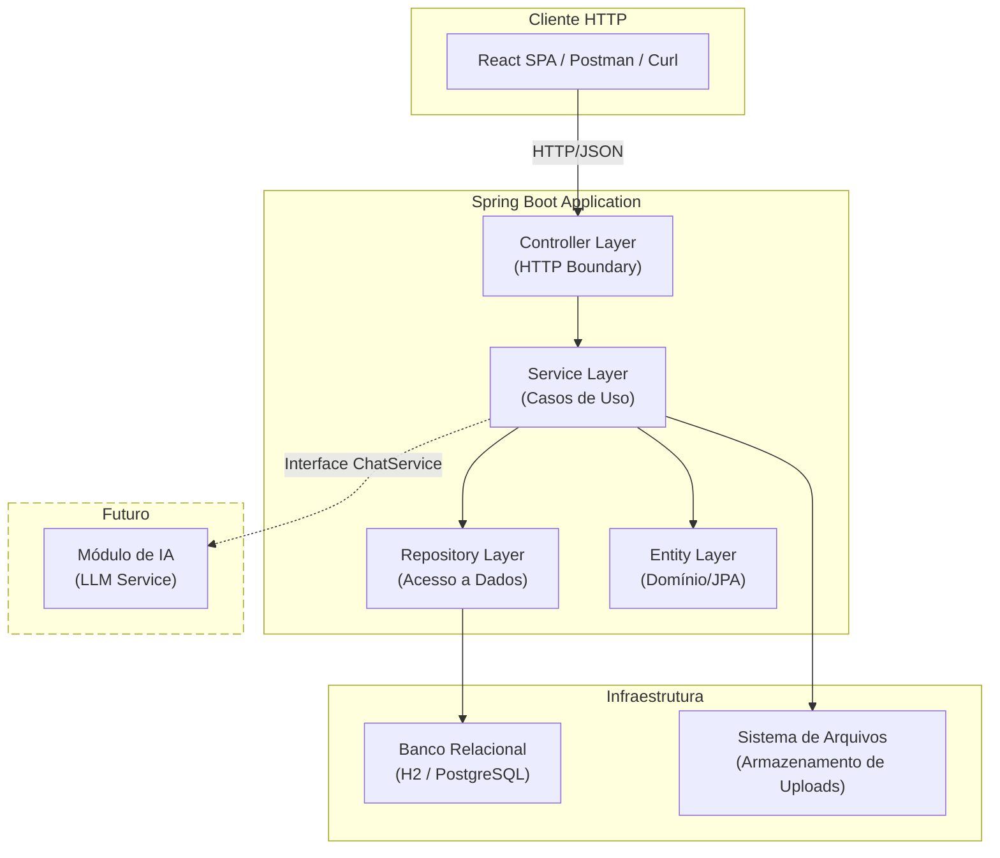
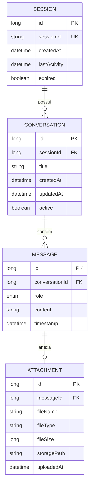
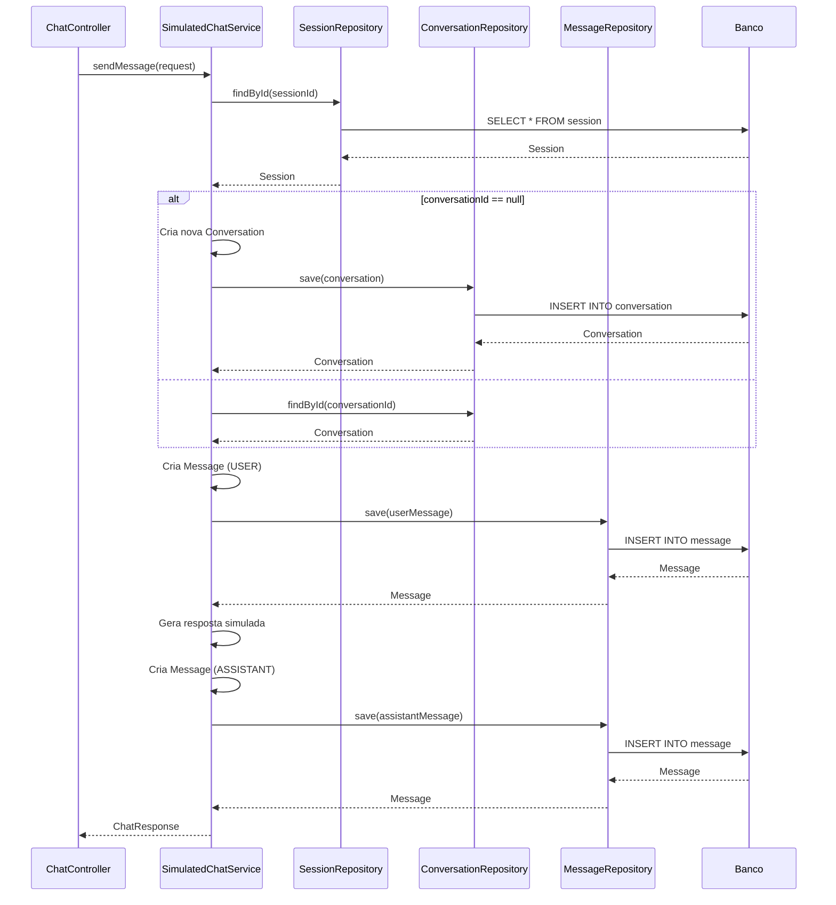
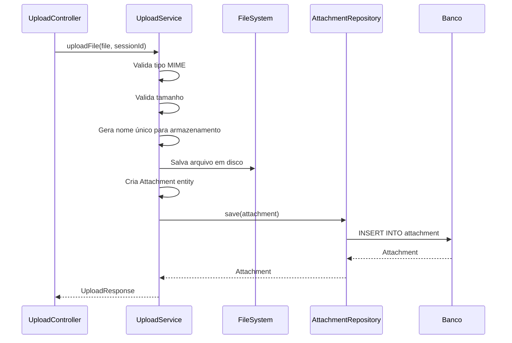
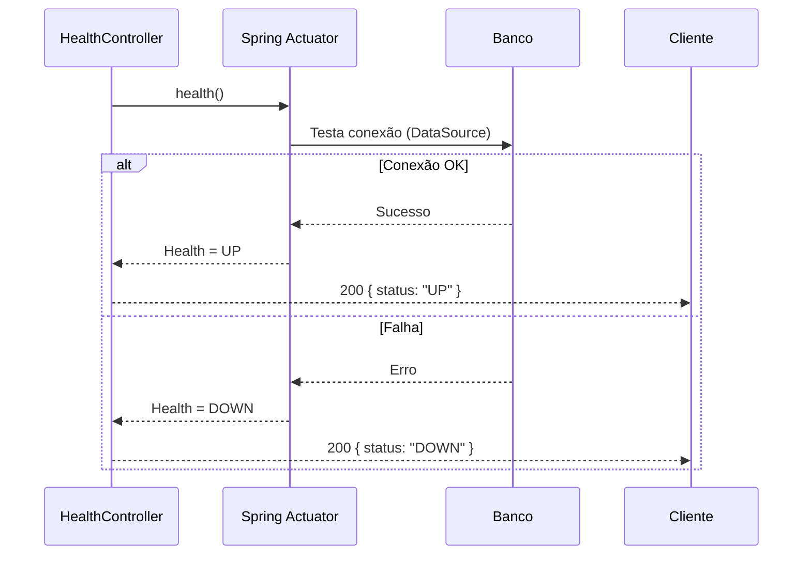

# System Docs — Back-end

> **Contrato oficial — Camada Back-end do Chat Inteligente**  
> Versão: 1.0.0  
> Stack: Java 17+, Spring Boot 3.x, JPA/Hibernate, H2/PostgreSQL  
> Propósito: Documentação arquitetural do back-end para equipe de desenvolvimento e geração automática de código por IA.

---

## Sumário

1. [Visão Geral do Back-end](#1-visão-geral-do-back-end)
2. [Arquitetura Back-end](#2-arquitetura-back-end)
3. [Domínio da Aplicação](#3-domínio-da-aplicação)
4. [API REST](#4-api-rest)
5. [Contratos JSON](#5-contratos-json)
6. [Fluxos do Back-end](#6-fluxos-do-back-end)
7. [Persistência](#7-persistência)
8. [Validações](#8-validações)
9. [Códigos HTTP](#9-códigos-http)
10. [Tratamento de Exceções](#10-tratamento-de-exceções)
11. [Requisitos Não Funcionais](#11-requisitos-não-funcionais)
12. [Estrutura de Diretórios](#12-estrutura-de-diretórios)
13. [README](#13-readme)
14. [AGENTS.md](#14-agentsmd)
15. [Considerações Arquiteturais](#15-considerações-arquiteturais)

---

# 1. Visão Geral do Back-end

## 1.1 Objetivo

API REST do sistema de chat que gerencia mensagens, sessões, conversas e upload de documentos (.txt e .pdf). Construída com Clean Architecture para garantir manutenibilidade, testabilidade e preparação para futura integração com Inteligência Artificial.

## 1.2 Tecnologias

| Componente | Tecnologia |
|------------|-----------|
| Linguagem | Java 17+ |
| Framework | Spring Boot 3.x |
| ORM | Spring Data JPA / Hibernate 6 |
| Banco (dev) | H2 Database (modo memória) |
| Banco (prod) | PostgreSQL 15+ |
| Testes | JUnit 5 + Mockito |
| Build | Maven 3.9+ |
| Documentação | Markdown + Mermaid |

## 1.3 Escopo

| Inclui | Não inclui |
|--------|-----------|
| CRUD de mensagens e conversas | Autenticação/autorização |
| Criação e gerenciamento de sessões | WebSocket / streaming |
| Upload de `.txt` e `.pdf` | Integração com LLM |
| Respostas simuladas de chat | Fila de processamento assíncrono |
| Health check da aplicação | Cache distribuído |
| Persistência relacional | Versionamento de anexos |

## 1.4 Arquitetura Geral do Back-end



---

# 2. Arquitetura Back-end

## 2.1 Clean Architecture

O back-end segue os princípios da **Clean Architecture** (Robert C. Martin), organizada em camadas concêntricas onde dependências apontam para dentro.

```
┌──────────────────────────────────────────────────┐
│                   Controllers                      │
│         (HTTP boundary — orquestração)             │
├──────────────────────────────────────────────────┤
│                    Services                         │
│         (Casos de uso — regras de negócio)          │
├──────────────────────────────────────────────────┤
│                   Repositories                      │
│            (Acesso a dados — persistência)          │
├──────────────────────────────────────────────────┤
│                    Entities                         │
│            (Modelo de domínio anêmico)              │
├──────────────────────────────────────────────────┤
│   DTOs  │  Config  │  Exception  │  Mapper  │ Util │
└──────────────────────────────────────────────────┘
```

## 2.2 Responsabilidade de Cada Camada

### Controller
- Receber requisições HTTP.
- Validar entrada (formato, presença de parâmetros) via `@Valid`.
- Invocar o Service apropriado.
- Retornar resposta HTTP com DTO e status code.
- **Não contém regra de negócio.**

```
@RestController
@RequestMapping("/api/chat")
public class ChatController {
    private final ChatService chatService;

    @PostMapping("/message")
    public ResponseEntity<ChatResponse> sendMessage(@RequestBody @Valid ChatRequest request) {
        ChatResponse response = chatService.sendMessage(request);
        return ResponseEntity.ok(response);
    }
}
```

### Service
- Implementar todos os casos de uso.
- Orquestrar entidades e repositórios.
- Aplicar regras de validação de negócio.
- Transformar entidades em DTOs (via Mapper).
- **Independente de HTTP** — sem referência a objetos de servlet.

```
@Service
public class SimulatedChatService implements ChatService {
    private final MessageRepository messageRepository;
    private final ConversationRepository conversationRepository;
    private final SessionRepository sessionRepository;
    private final MessageMapper messageMapper;

    public ChatResponse sendMessage(ChatRequest request) {
        // 1. Validar sessão
        Session session = sessionRepository.findById(request.sessionId())
            .orElseThrow(() -> new ResourceNotFoundException("Sessão não encontrada"));

        // 2. Obter ou criar conversa
        Conversation conversation = conversationRepository.findById(request.conversationId())
            .orElseGet(() -> createNewConversation(session));

        // 3. Salvar mensagem do usuário
        Message userMessage = messageMapper.toEntity(request, conversation, Role.USER);
        messageRepository.save(userMessage);

        // 4. Gerar resposta simulada
        Message assistantMessage = generateSimulatedResponse(conversation, request.content());

        // 5. Salvar resposta
        messageRepository.save(assistantMessage);

        // 6. Retornar DTO
        return messageMapper.toChatResponse(userMessage, assistantMessage);
    }
}
```

### Repository
- Interface com o banco via Spring Data JPA.
- Métodos de CRUD e consultas customizadas com `@Query`.
- **Não contém regra de negócio.**

```
public interface MessageRepository extends JpaRepository<Message, Long> {
    List<Message> findByConversationIdOrderByTimestampAsc(Long conversationId);

    @Query("SELECT COUNT(m) FROM Message m WHERE m.conversation.id = :conversationId")
    long countByConversationId(@Param("conversationId") Long conversationId);
}
```

### Entity
- Modelo de domínio com anotações JPA.
- Relacionamentos, constraints e cascade.
- Estado puro — sem lógica de negócio complexa.

### DTO
- `request/`: dados recebidos na API.
- `response/`: dados devolvidos na API.
- Isolam a representação externa do modelo interno.

| DTO | Tipo | Finalidade |
|-----|------|------------|
| `ChatRequest` | Request | sessionId, conversationId, content, attachmentId |
| `ChatResponse` | Response | userMessage, assistantMessage |
| `HistoryResponse` | Response | sessionId, lista de conversas |
| `HealthResponse` | Response | status, database, diskSpace, timestamp, version |
| `SessionResponse` | Response | sessionId, createdAt, lastActivity, expired |
| `UploadResponse` | Response | attachmentId, fileName, fileType, fileSize, uploadedAt |
| `ErrorResponse` | Response | status, error, message, timestamp, path |

### Exception
- Hierarquia de exceções de negócio.
- `GlobalExceptionHandler` com `@RestControllerAdvice` mapeia para HTTP.

### Configuration
- Beans do Spring: CORS, ObjectMapper, propriedades de upload.

### Mapper
- Converte Entity ↔ DTO.
- Utiliza padrão Builder ou MapStruct.

### Util
- Funções auxiliares: extração de texto de PDF, formatação.

## 2.3 Regras Fundamentais

> **Regra 1:** Controller **nunca** contém regra de negócio.  
> **Regra 2:** Service **nunca** acessa objetos HTTP.  
> **Regra 3:** Repository **nunca** contém lógica condicional de negócio.  
> **Regra 4:** DTO **nunca** é usado fora das camadas Controller e Service.  
> **Regra 5:** Entity **nunca** expõe setters públicos para campos sensíveis.

---

# 3. Domínio da Aplicação

## 3.1 Entidades

### Session

| Atributo | Tipo | Descrição |
|----------|------|-----------|
| `id` | `Long` | Identificador único |
| `sessionId` | `String` | UUID público da sessão |
| `createdAt` | `LocalDateTime` | Data de criação |
| `lastActivity` | `LocalDateTime` | Última interação |
| `expired` | `boolean` | Se a sessão expirou |

**Relacionamentos:** `1:N` com `Conversation`

---

### Conversation

| Atributo | Tipo | Descrição |
|----------|------|-----------|
| `id` | `Long` | Identificador único |
| `session` | `Session` | Sessão pai |
| `title` | `String` | Título gerado automaticamente |
| `createdAt` | `LocalDateTime` | Data de criação |
| `updatedAt` | `LocalDateTime` | Última atividade |
| `active` | `boolean` | Se está ativa |

**Relacionamentos:** `N:1` com `Session`, `1:N` com `Message`

---

### Message

| Atributo | Tipo | Descrição |
|----------|------|-----------|
| `id` | `Long` | Identificador único |
| `conversation` | `Conversation` | Conversa pai |
| `role` | `enum (USER, ASSISTANT)` | Remetente |
| `content` | `String (TEXT)` | Conteúdo |
| `timestamp` | `LocalDateTime` | Momento do envio |
| `attachment` | `Attachment` | Anexo opcional |

**Relacionamentos:** `N:1` com `Conversation`, `1:1` opcional com `Attachment`

---

### Attachment

| Atributo | Tipo | Descrição |
|----------|------|-----------|
| `id` | `Long` | Identificador único |
| `message` | `Message` | Mensagem associada |
| `fileName` | `String` | Nome original |
| `fileType` | `String` | Tipo MIME |
| `fileSize` | `Long` | Tamanho em bytes |
| `storagePath` | `String` | Caminho físico |
| `uploadedAt` | `LocalDateTime` | Data do upload |

**Relacionamentos:** `1:1` com `Message`

---

### HealthStatus (Value Object)

| Atributo | Tipo | Descrição |
|----------|------|-----------|
| `status` | `String` | `UP` ou `DOWN` |
| `database` | `String` | Status do banco |
| `diskSpace` | `String` | Espaço disponível |
| `timestamp` | `LocalDateTime` | Momento da verificação |
| `version` | `String` | Versão da aplicação |

> **Nota:** `HealthStatus` não é entidade persistida — é Value Object/DTO retornado pelo health check.

## 3.2 Modelo Conceitual (ER)



---

# 4. API REST

## 4.1 Endpoints

### `GET /api/health`

| Campo | Valor |
|-------|-------|
| Método | `GET` |
| URL | `/api/health` |
| Descrição | Verifica saúde da aplicação e conexões |
| Payload Entrada | — |
| Payload Saída | `HealthResponse` |
| Status Sucesso | `200 OK` |
| Erros | `500` (banco inacessível retorna `status: "DOWN"`) |

---

### `GET /api/session`

| Campo | Valor |
|-------|-------|
| Método | `GET` |
| URL | `/api/session` |
| Descrição | Cria nova sessão ou retorna sessão existente (futuro) |
| Payload Entrada | — |
| Payload Saída | `SessionResponse` |
| Status Sucesso | `200 OK` |
| Erros | — |

---

### `DELETE /api/session/{sessionId}`

| Campo | Valor |
|-------|-------|
| Método | `DELETE` |
| URL | `/api/session/{sessionId}` |
| Descrição | Encerra uma sessão |
| Payload Entrada | — |
| Payload Saída | — |
| Status Sucesso | `204 No Content` |
| Erros | `404` (sessão não encontrada) |

---

### `POST /api/chat/message`

| Campo | Valor |
|-------|-------|
| Método | `POST` |
| URL | `/api/chat/message` |
| Descrição | Envia mensagem e recebe resposta simulada |
| Payload Entrada | `ChatRequest` |
| Payload Saída | `ChatResponse` |
| Status Sucesso | `200 OK` |
| Erros | `400`, `404`, `422` |

---

### `GET /api/chat/history/{sessionId}`

| Campo | Valor |
|-------|-------|
| Método | `GET` |
| URL | `/api/chat/history/{sessionId}` |
| Descrição | Recupera lista de conversas da sessão |
| Payload Entrada | — |
| Payload Saída | `HistoryResponse` |
| Status Sucesso | `200 OK` |
| Erros | `404` |

---

### `GET /api/chat/history/{sessionId}/{conversationId}`

| Campo | Valor |
|-------|-------|
| Método | `GET` |
| URL | `/api/chat/history/{sessionId}/{conversationId}` |
| Descrição | Recupera mensagens de uma conversa |
| Payload Entrada | — |
| Payload Saída | `ConversationResponse` |
| Status Sucesso | `200 OK` |
| Erros | `404` |

---

### `POST /api/upload`

| Campo | Valor |
|-------|-------|
| Método | `POST` |
| URL | `/api/upload` |
| Descrição | Upload de arquivo `.txt` ou `.pdf` |
| Payload Entrada | `multipart/form-data` (`file` + `sessionId`) |
| Payload Saída | `UploadResponse` |
| Status Sucesso | `200 OK` |
| Erros | `400`, `413`, `415` |

## 4.2 Tabela Resumo

| Método | URL | Controller | Service |
|--------|-----|------------|---------|
| `GET` | `/api/health` | `HealthController` | — (Spring Actuator) |
| `GET` | `/api/session` | `SessionController` | `SessionService` |
| `DELETE` | `/api/session/{sessionId}` | `SessionController` | `SessionService` |
| `POST` | `/api/chat/message` | `ChatController` | `ChatService` |
| `GET` | `/api/chat/history/{sessionId}` | `ChatController` | `ChatService` |
| `GET` | `/api/chat/history/{sessionId}/{conversationId}` | `ChatController` | `ChatService` |
| `POST` | `/api/upload` | `UploadController` | `UploadService` |

---

# 5. Contratos JSON

## 5.1 `POST /api/chat/message`

### Request
```json
{
  "sessionId": "a1b2c3d4-e5f6-7890-abcd-ef1234567890",
  "conversationId": null,
  "content": "Qual é a capital da França?",
  "attachmentId": null
}
```

### Response (200)
```json
{
  "userMessage": {
    "id": 10,
    "conversationId": 1,
    "role": "USER",
    "content": "Qual é a capital da França?",
    "timestamp": "2026-06-25T14:30:00Z",
    "attachment": null
  },
  "assistantMessage": {
    "id": 11,
    "conversationId": 1,
    "role": "ASSISTANT",
    "content": "A capital da França é Paris.",
    "timestamp": "2026-06-25T14:30:01Z",
    "attachment": null
  },
  "conversationId": 1
}
```

### Erro (400 — validação)
```json
{
  "status": 400,
  "error": "Bad Request",
  "message": "O conteúdo da mensagem não pode estar vazio.",
  "timestamp": "2026-06-25T14:30:00Z",
  "path": "/api/chat/message"
}
```

### Erro (404 — sessão não encontrada)
```json
{
  "status": 404,
  "error": "Not Found",
  "message": "Sessão não encontrada: a1b2c3d4-e5f6-7890-abcd-ef1234567890",
  "timestamp": "2026-06-25T14:30:00Z",
  "path": "/api/chat/message"
}
```

### Erro (422 — mensagem inválida)
```json
{
  "status": 422,
  "error": "Unprocessable Entity",
  "message": "A mensagem excede o limite de 5000 caracteres.",
  "timestamp": "2026-06-25T14:30:00Z",
  "path": "/api/chat/message"
}
```

---

## 5.2 `GET /api/chat/history/{sessionId}`

### Response (200)
```json
{
  "sessionId": "a1b2c3d4-e5f6-7890-abcd-ef1234567890",
  "conversations": [
    {
      "id": 1,
      "title": "Capitais do mundo",
      "messageCount": 4,
      "lastMessage": "A capital da França é Paris.",
      "lastActivity": "2026-06-25T14:30:01Z"
    }
  ]
}
```

### Erro (404)
```json
{
  "status": 404,
  "error": "Not Found",
  "message": "Nenhuma conversa encontrada para a sessão: uuid-invalido",
  "timestamp": "2026-06-25T14:30:00Z",
  "path": "/api/chat/history/uuid-invalido"
}
```

---

## 5.3 `POST /api/upload`

### Request (multipart/form-data)

| Campo | Tipo | Obrigatório | Descrição |
|-------|------|-------------|-----------|
| `file` | `File` | Sim | Arquivo `.txt` ou `.pdf` (máx. 10 MB) |
| `sessionId` | `String` | Sim | UUID da sessão |

### Response (200)
```json
{
  "attachmentId": 5,
  "fileName": "relatorio.pdf",
  "fileType": "application/pdf",
  "fileSize": 2048000,
  "uploadedAt": "2026-06-25T15:00:00Z",
  "message": "Arquivo enviado com sucesso."
}
```

### Erro (400 — arquivo não enviado)
```json
{
  "status": 400,
  "error": "Bad Request",
  "message": "Nenhum arquivo foi enviado.",
  "timestamp": "2026-06-25T15:00:00Z",
  "path": "/api/upload"
}
```

### Erro (413 — arquivo excede limite)
```json
{
  "status": 413,
  "error": "Payload Too Large",
  "message": "O arquivo excede o limite máximo de 10 MB.",
  "timestamp": "2026-06-25T15:00:00Z",
  "path": "/api/upload"
}
```

### Erro (415 — formato não suportado)
```json
{
  "status": 415,
  "error": "Unsupported Media Type",
  "message": "Formato de arquivo não suportado. Utilize .txt ou .pdf.",
  "timestamp": "2026-06-25T15:00:00Z",
  "path": "/api/upload"
}
```

---

## 5.4 `GET /api/health`

### Response (200 — UP)
```json
{
  "status": "UP",
  "database": "UP",
  "diskSpace": "OK (15.3 GB disponível)",
  "timestamp": "2026-06-25T14:30:00Z",
  "version": "1.0.0"
}
```

### Response (200 — DOWN)
```json
{
  "status": "DOWN",
  "database": "DOWN",
  "diskSpace": "OK (15.3 GB disponível)",
  "timestamp": "2026-06-25T14:30:00Z",
  "version": "1.0.0"
}
```

---

## 5.5 `GET /api/session`

### Response (200)
```json
{
  "sessionId": "a1b2c3d4-e5f6-7890-abcd-ef1234567890",
  "createdAt": "2026-06-25T14:30:00Z",
  "lastActivity": "2026-06-25T14:30:00Z",
  "expired": false
}
```

---

## 5.6 Erro Genérico (500)
```json
{
  "status": 500,
  "error": "Internal Server Error",
  "message": "Ocorreu um erro inesperado. Tente novamente mais tarde.",
  "timestamp": "2026-06-25T14:30:00Z",
  "path": "/api/chat/message"
}
```

---

# 6. Fluxos do Back-end

## 6.1 Fluxo de Envio de Mensagem



## 6.2 Fluxo de Upload



## 6.3 Fluxo de Health Check



---

# 7. Persistência

## 7.1 Políticas

| Relacionamento | Cascade | Fetch |
|----------------|---------|-------|
| `Session → Conversation` | `ALL` | `LAZY` |
| `Conversation → Message` | `ALL` | `LAZY` |
| `Message → Attachment` | `ALL` | `LAZY` |

## 7.2 Regras de Remoção

- Remover uma `Session` remove todas as suas `Conversation`, `Message` e `Attachment` em cascata.
- Remover uma `Conversation` remove todas as suas `Message` e `Attachment` em cascata.
- Remover uma `Message` remove seu `Attachment` em cascata (e o arquivo físico deve ser excluído pelo service).

## 7.3 Índices Sugeridos

| Tabela | Coluna(s) | Tipo |
|--------|-----------|------|
| `session` | `session_id` | Único |
| `conversation` | `session_id` | Simples |
| `message` | `conversation_id` | Simples |
| `message` | `timestamp` | Simples (para ordenação) |

## 7.4 Configuração de Pool

```
spring.datasource.hikari.maximum-pool-size=10
spring.datasource.hikari.minimum-idle=2
spring.datasource.hikari.connection-timeout=30000
```

---

# 8. Validações

## 8.1 Tabela de Validações

| Regra | Camada | HTTP | Mensagem |
|-------|--------|------|----------|
| `content` nulo ou vazio | Controller (`@NotBlank`) | `422` | "O conteúdo da mensagem não pode estar vazio." |
| `content` > 5000 caracteres | Service | `422` | "A mensagem excede o limite de 5000 caracteres." |
| `sessionId` em formato inválido | Controller | `400` | "O identificador de sessão fornecido é inválido." |
| `sessionId` não encontrado | Service | `404` | "Sessão não encontrada: {sessionId}" |
| `conversationId` não encontrado | Service | `404` | "Conversa não encontrada: {conversationId}" |
| `file` ausente | Controller | `400` | "Nenhum arquivo foi enviado." |
| `file` > 10 MB | Controller | `413` | "O arquivo excede o limite máximo de 10 MB." |
| Tipo MIME diferente de `text/plain` ou `application/pdf` | Service | `415` | "Formato de arquivo não suportado. Utilize .txt ou .pdf." |
| Arquivo corrompido | Service | `400` | "O arquivo enviado está corrompido ou é inválido." |

## 8.2 Estrutura do ErrorResponse

```json
{
  "status": 422,
  "error": "Unprocessable Entity",
  "message": "A mensagem excede o limite de 5000 caracteres.",
  "timestamp": "2026-06-25T14:30:00Z",
  "path": "/api/chat/message",
  "errors": [
    { "field": "content", "message": "tamanho deve ser entre 1 e 5000" }
  ]
}
```

---

# 9. Códigos HTTP

| Código | Descrição | Uso |
|--------|-----------|-----|
| `200 OK` | Requisição bem-sucedida | Respostas com body |
| `201 Created` | Recurso criado | (Futuro) |
| `204 No Content` | Sucesso sem body | `DELETE /api/session/{sessionId}` |
| `400 Bad Request` | Erro de sintaxe/validação | JSON malformado, parâmetro ausente |
| `404 Not Found` | Recurso inexistente | Sessão, conversa ou anexo não encontrado |
| `409 Conflict` | Conflito de estado | (Futuro) Sessão expirada |
| `413 Payload Too Large` | Arquivo > 10 MB | Upload excede limite |
| `415 Unsupported Media Type` | Tipo não permitido | Upload de formato não suportado |
| `422 Unprocessable Entity` | Validação de negócio | Mensagem vazia, conteúdo inválido |
| `500 Internal Server Error` | Erro interno | Exceção não tratada |

---

# 10. Tratamento de Exceções

## 10.1 Hierarquia de Exceções

```
RuntimeException
├── ResourceNotFoundException      → 404
├── ValidationException            → 422
├── FileTooLargeException          → 413 (lançado pelo service)
├── UnsupportedFileTypeException   → 415
└── FileCorruptedException         → 400
```

## 10.2 GlobalExceptionHandler

```java
@RestControllerAdvice
public class GlobalExceptionHandler {

    @ExceptionHandler(ResourceNotFoundException.class)
    public ResponseEntity<ErrorResponse> handleNotFound(ResourceNotFoundException ex) {
        return ResponseEntity.status(404).body(new ErrorResponse(404, "Not Found", ex.getMessage()));
    }

    @ExceptionHandler(ValidationException.class)
    public ResponseEntity<ErrorResponse> handleValidation(ValidationException ex) {
        return ResponseEntity.status(422).body(new ErrorResponse(422, "Unprocessable Entity", ex.getMessage()));
    }

    @ExceptionHandler(UnsupportedFileTypeException.class)
    public ResponseEntity<ErrorResponse> handleUnsupportedFile(UnsupportedFileTypeException ex) {
        return ResponseEntity.status(415).body(new ErrorResponse(415, "Unsupported Media Type", ex.getMessage()));
    }

    @ExceptionHandler(Exception.class)
    public ResponseEntity<ErrorResponse> handleGeneric(Exception ex) {
        return ResponseEntity.status(500).body(new ErrorResponse(500, "Internal Server Error", "Erro inesperado."));
    }
}
```

---

# 11. Requisitos Não Funcionais

## 11.1 Escalabilidade

- Back-end **stateless** — sessões são identificadas por UUID, não por sessão HTTP.
- Pool de conexões HikariCP configurável.
- Preparado para balanceamento de carga horizontal.

## 11.2 Manutenibilidade

- Clean Architecture com responsabilidades claras.
- Nomenclatura padronizada (PT para mensagens, EN para código).
- Logs estruturados nos Services.

## 11.3 Testabilidade

- Services testáveis com Mockito (sem Spring Context).
- Repositories testáveis com `@DataJpaTest`.
- Controllers testáveis com `MockMvc`.

## 11.4 Performance

- Consultas paginadas no histórico (`Pageable`).
- Upload processado em stream (`MultipartFile.getInputStream()`).
- Timeouts configurados globalmente.

## 11.5 Segurança

- `MultipartFile` validado antes do processamento.
- Arquivos salvos fora do diretório público.
- Tamanho máximo configurado em `application.yml`.

## 11.6 Observabilidade

- Logs com níveis: `INFO` (fluxo normal), `WARN` (validações), `ERROR` (exceções).
- Endpoint `/api/health` para monitoramento.
- (Futuro) Métricas via Spring Actuator + Prometheus.

---

# 12. Estrutura de Diretórios

```
chat-backend/
├── pom.xml
├── src/
│   ├── main/
│   │   ├── java/com/project/chat/
│   │   │   ├── ChatApplication.java
│   │   │   ├── controller/
│   │   │   │   ├── ChatController.java
│   │   │   │   ├── HealthController.java
│   │   │   │   ├── SessionController.java
│   │   │   │   └── UploadController.java
│   │   │   ├── service/
│   │   │   │   ├── ChatService.java
│   │   │   │   ├── SimulatedChatService.java
│   │   │   │   ├── SessionService.java
│   │   │   │   ├── UploadService.java
│   │   │   │   └── FileStorageService.java
│   │   │   ├── repository/
│   │   │   │   ├── ConversationRepository.java
│   │   │   │   ├── MessageRepository.java
│   │   │   │   ├── AttachmentRepository.java
│   │   │   │   └── SessionRepository.java
│   │   │   ├── entity/
│   │   │   │   ├── Conversation.java
│   │   │   │   ├── Message.java
│   │   │   │   ├── Attachment.java
│   │   │   │   └── Session.java
│   │   │   ├── dto/
│   │   │   │   ├── request/
│   │   │   │   │   ├── ChatRequest.java
│   │   │   │   │   └── UploadRequest.java
│   │   │   │   └── response/
│   │   │   │       ├── ChatResponse.java
│   │   │   │       ├── ConversationResponse.java
│   │   │   │       ├── HistoryResponse.java
│   │   │   │       ├── HealthResponse.java
│   │   │   │       ├── SessionResponse.java
│   │   │   │       ├── UploadResponse.java
│   │   │   │       └── ErrorResponse.java
│   │   │   ├── config/
│   │   │   │   ├── CorsConfig.java
│   │   │   │   ├── WebConfig.java
│   │   │   │   └── StorageProperties.java
│   │   │   ├── exception/
│   │   │   │   ├── GlobalExceptionHandler.java
│   │   │   │   ├── ResourceNotFoundException.java
│   │   │   │   ├── ValidationException.java
│   │   │   │   ├── FileTooLargeException.java
│   │   │   │   ├── UnsupportedFileTypeException.java
│   │   │   │   └── FileCorruptedException.java
│   │   │   ├── mapper/
│   │   │   │   ├── MessageMapper.java
│   │   │   │   ├── ConversationMapper.java
│   │   │   │   └── AttachmentMapper.java
│   │   │   └── util/
│   │   │       ├── PdfTextExtractor.java
│   │   │       └── FileUtils.java
│   │   └── resources/
│   │       ├── application.yml
│   │       ├── application-dev.yml
│   │       └── application-prod.yml
│   └── test/
│       └── java/com/project/chat/
│           ├── service/
│           │   ├── SimulatedChatServiceTest.java
│           │   └── UploadServiceTest.java
│           ├── controller/
│           │   ├── ChatControllerTest.java
│           │   ├── HealthControllerTest.java
│           │   └── UploadControllerTest.java
│           └── repository/
│               ├── ConversationRepositoryTest.java
│               └── MessageRepositoryTest.java
```

---

# 13. README

```markdown
# Chat Backend

API REST do sistema de chat com suporte a upload de documentos.

## Tecnologias

- Java 17+
- Spring Boot 3.x
- Spring Data JPA / Hibernate 6
- H2 (dev) / PostgreSQL (prod)
- JUnit 5 + Mockito
- Maven 3.9+

## Pré-requisitos

- JDK 17+
- Maven 3.9+

## Instalação

```bash
git clone <repo-url>
cd chat-backend
mvn clean install
```

## Desenvolvimento

```bash
mvn spring-boot:run -Dspring-boot.run.profiles=dev
```

A API estará disponível em `http://localhost:8080`.

## Perfis

| Perfil | Banco | Finalidade |
|--------|-------|------------|
| `dev` | H2 (memória) | Desenvolvimento local |
| `prod` | PostgreSQL | Produção |

## Testes

```bash
mvn test
```

## Build

```bash
mvn package -DskipTests
```

## Configurações Principais

```yaml
spring:
  servlet:
    multipart:
      max-file-size: 10MB
      max-request-size: 10MB
```

## Estrutura do Projeto

```
src/main/java/com/project/chat/
├── controller/    # Endpoints REST
├── service/       # Regras de negócio
├── repository/    # Acesso a dados
├── entity/        # Modelo JPA
├── dto/           # Objetos de transferência
├── config/        # Configurações Spring
├── exception/     # Exceções + handler global
├── mapper/        # Conversores Entity ↔ DTO
└── util/          # Utilitários
```

## Variáveis de Ambiente

| Variável | Obrigatório | Padrão | Descrição |
|----------|-------------|--------|-----------|
| `SPRING_PROFILES_ACTIVE` | Não | `dev` | Perfil ativo |
| `DATABASE_URL` | Prod | — | URL JDBC do PostgreSQL |
| `DATABASE_USER` | Prod | — | Usuário do banco |
| `DATABASE_PASSWORD` | Prod | — | Senha do banco |
| `UPLOAD_DIR` | Não | `./uploads` | Diretório de uploads |

## Endpoints

| Método | URL | Descrição |
|--------|-----|-----------|
| GET | `/api/health` | Health check |
| GET | `/api/session` | Criar sessão |
| DELETE | `/api/session/{sessionId}` | Encerrar sessão |
| POST | `/api/chat/message` | Enviar mensagem |
| GET | `/api/chat/history/{sessionId}` | Histórico da sessão |
| GET | `/api/chat/history/{sessionId}/{conversationId}` | Conversa específica |
| POST | `/api/upload` | Upload de arquivo |
```

---

# 14. AGENTS.md

```markdown
# AGENTS.md — Contexto para Geração do Back-end

## Objetivo

Gerar a API REST em Java 17+ com Spring Boot 3.x para sistema de chat com upload de documentos.

## Escopo

- CRUD: Session, Conversation, Message, Attachment
- Upload de `.txt` e `.pdf` (máximo 10 MB)
- Respostas simuladas de chat
- Health check via `/api/health`
- Clean Architecture com camadas Controller → Service → Repository → Entity

## Tecnologias

- Java 17+, Spring Boot 3.x, Spring Data JPA, Hibernate 6
- H2 (dev), PostgreSQL (prod)
- JUnit 5, Mockito, MockMvc
- Maven 3.9+

## Regras de Implementação

1. **Controllers** não contêm regra de negócio — apenas delegam para Services.
2. **Services** implementam a interface `ChatService` (porta) — não dependem de HTTP.
3. **Repositories** estendem `JpaRepository` — sem lógica condicional.
4. **Entities** usam `Long` como ID, `LocalDateTime` para timestamps.
5. **DTOs** separados em `request/` e `response/` — não expor entities na API.
6. **Exception** hierarchy + `GlobalExceptionHandler` com `@RestControllerAdvice`.
7. **Mappers** convertem Entity ↔ DTO (Builder ou MapStruct).
8. Validações duplicadas: `@Valid` no Controller + regras de negócio no Service.
9. Logs estruturados: INFO (fluxo), WARN (validação), ERROR (exceção).
10. Nomes em inglês para código, português para mensagens ao usuário.

## Estrutura de Pacotes

```
com.project.chat
├── controller
├── service
├── repository
├── entity
├── dto (request/, response/)
├── config
├── exception
├── mapper
└── util
```

## Contrato da API

Ver seção 4 (API REST) e seção 5 (Contratos JSON) deste documento.

## Pontos de Extensão para IA

- `ChatService` é uma **interface**. `SimulatedChatService` é a implementação atual.
- Para integrar IA: criar `AIChatService implements ChatService` e injetar via Spring.
- Nenhuma alteração em Controllers, Repositories ou DTOs é necessária.
```

---

# 15. Considerações Arquiteturais

## 15.1 Clean Architecture

**Decisão:** Organizar o back-end em camadas concêntricas.

**Justificativa:**
- Regras de negócio (Services) independem de frameworks — podem ser reutilizadas em filas, schedulers ou CLIs.
- Testabilidade: Services são testados sem Spring Context.
- Preparação para IA: a interface `ChatService` permite trocar `SimulatedChatService` por `AIChatService` sem alterar Controllers ou Repositories.

## 15.2 DTOs

**Decisão:** Isolar a representação externa dos dados.

**Justificativa:**
- `Attachment` contém `storagePath` — atributo que **nunca** deve ser exposto na API.
- A resposta do histórico inclui `messageCount`, que é calculado, não armazenado.
- Mudanças no modelo JPA não quebram o contrato da API — apenas o mapper precisa ser atualizado.

## 15.3 Services Independentes de HTTP

**Decisão:** Services não acessam `HttpServletRequest`, `HttpServletResponse` ou `HttpSession`.

**Justificativa:**
- Portabilidade: o mesmo `SessionService` pode ser usado por um Controller REST e um scheduler de expiração de sessões.
- Testabilidade: sem necessidade de mockar objetos HTTP.
- Alinhamento com Clean Architecture: detalhes de infraestrutura (HTTP) não vazam para a camada de caso de uso.

## 15.4 Tratamento de Exceções Centralizado

**Decisão:** `GlobalExceptionHandler` único com `@RestControllerAdvice`.

**Justificativa:**
- Consistência: toda exception de negócio retorna a mesma estrutura JSON (`ErrorResponse`).
- Manutenibilidade: lógica de mapeamento exception → HTTP em um único lugar.
- Extensibilidade: novas exceções são adicionadas com um único método no handler.

## 15.5 Interface para ChatService

**Decisão:** `ChatService` como interface, `SimulatedChatService` como implementação.

**Justificativa:**
- Permite substituir o simulador por IA real sem modificar o contrato.
- O `ChatController` depende da abstração, não da implementação concreta.
- Facilita testes: mock de `ChatService` nos testes de controller.

## 15.6 Preparação para IA

A interface `ChatService` expõe:

```java
public interface ChatService {
    ChatResponse sendMessage(ChatRequest request);
    HistoryResponse getHistory(String sessionId);
    ConversationResponse getConversation(String sessionId, Long conversationId);
}
```

Para integrar com IA:
1. Criar `AIChatService implements ChatService` que chama um LLM.
2. Substituir o bean no Spring (`@Primary` ou perfil `ai`).
3. A interface `ChatService` pode ser estendida com `sendMessageWithContext()` que envia o histórico completo como contexto para o LLM.

---

> **Documento gerado em: 25 de junho de 2026**  
> **Versão: 1.0.0**  
> **Status: aprovado**
